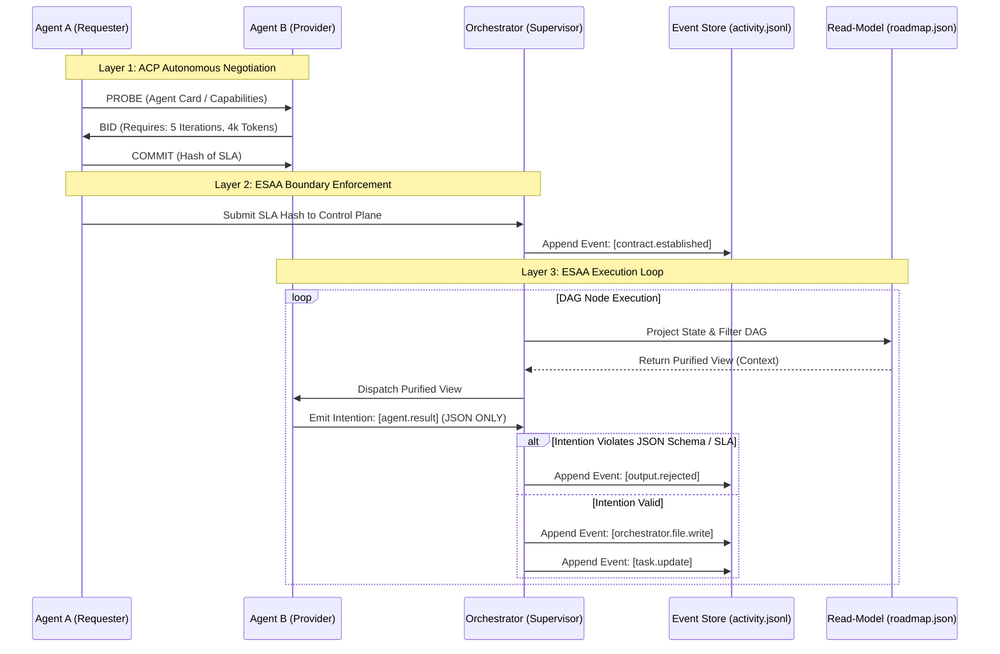

import { Callout } from 'fumadocs-ui/components/callout';

<Callout title="Draft" type="warn">
Agent Communication Protocol spec.
</Callout>

## *The Agent Communication Protocol (ACP)*

**Core Philosophy & Architecture**

- **The Interoperability Crisis:** Current multi-agent systems suffer from a "context bottleneck" and operate in proprietary silos. ACP is designed as the "TCP/IP of the Agentic Web," providing a federated layer for discovery, transport, and semantic alignment across different environments.

- **Federated Orchestration:** ACP abandons centralized brokers. It relies on a decentralized, peer-to-peer network where agents autonomously find and contract with one another via Service-Level Agreements (SLAs).

- **The 4-Layer Model:**

	1. **Transport Layer:** Defaults to gRPC for low-latency, but supports WebSockets and HTTPS. Secures packets via TLS 1.3.

	2. **Semantic Layer:** Translates high-level goals into standardized `JSON-LD`. Uses an "ontology of intent" (e.g., `QUERY`, `EXECUTE`, `NEGOTIATE`) so heterogeneous models understand each other without verbose natural language.

	3. **Negotiation Layer:** Facilitates the exchange of "Agent Cards" and dynamic SLAs. SLAs define resource limits, scope, cost, and error handling protocols.

	4. **Governance & Security Layer:** Enforces "Zero-Trust" using Decentralized Identifiers (DIDs) and cryptographically signed messages.

**Mechanics of Interaction**

- **Agent Cards:** A machine-readable profile containing the agent's unique DID, advertised capabilities (e.g., `[data_analysis]`), operational constraints (e.g., `max_latency: 500ms`), and a peer-reviewed Trust Score.

- **The 4-Stage A2A Negotiation Lifecycle:**

	1. **Inquiry:** Requester sends a `PROBE` message based on the Provider's Agent Card.

	2. **Proposal:** Provider responds with a `BID`, outlining required resources and estimated time.

	3. **Agreement:** Requester sends a `COMMIT` message containing a cryptographic hash of the agreed parameters (creating a "soft contract").

	4. **Execution & Settlement:** Provider executes, returns proof, and Requester updates the Provider's reputation score on the ledger.

- **Zero-Trust Agentic Security (ZTAS):** Every action requires a "Proof-of-Intent" (PoI) cryptographic signature linking the action to user-authorized intent. This prevents compromised agents from executing unauthorized workflows.

---

## Architecture Overview

### The End-to-End Task Lifecycle

#### Phase 1: Task Initialization & DAG Construction

- A human defines a high-level objective.
    
- The Orchestrator LLM breaks this objective into a Directed Acyclic Graph (DAG) of sub-tasks.
    
- The Orchestrator deterministically appends `task.create` events to the event store, projecting an initial `roadmap.json`.
    

#### Phase 2: Agent Discovery & Negotiation (ACP Layer)

The system utilizes a federated discovery and negotiation model:

- **Inquiry:** The Orchestrator broadcasts a `PROBE` message to available agents based on the required role.
	
- **Proposal:** Compatible agents evaluate their load and respond with a `BID` outlining the token budget and iterations required.
    
- **Agreement:** The Orchestrator selects the optimal agent and sends a `COMMIT` message containing a cryptographic hash of the Service Level Agreement (SLA). This budget is recorded as a boundary contract.
    

#### Phase 3: The Execution Loop (ESAA Layer)

- **Context Injection:** The Orchestrator projects the state and generates a "Purified View" for the assigned agent, injecting only the `artifacts_in_scope` defined by the DAG's `depends_on` edges.
    
- **Agent Intention:** The agent executes the task and emits an `agent.result` JSON payload containing its token usage, produced artifact hashes, and Proof-of-Intent signature.
    
- **Validation:** The Orchestrator intercepts the JSON. If the agent violated the schema or exceeded the SLA budget, the Orchestrator appends `output.rejected`.
    
- **State Mutation:** If valid, the Orchestrator persists the event to `activity.jsonl`, applies any actual file-writing effects (`orchestrator.file.write`), and recalculates the `roadmap.json`.
    

#### Phase 4: Verification

- To ensure the `roadmap.json` is perfectly synchronized with the event log, the Orchestrator performs deterministic canonicalization on the JSON.
    
- It calculates a SHA-256 hash (`projection_hash_sha256`). If this hash diverges from expectations, the run is marked as corrupted.

### System Constraints and Gaps

#### 1. Latency and Processing Overhead

- **The ACP Penalty:** Moving from a centralized trust model to a Zero-Trust Federated model incurs a latency penalty. Cryptographic DID verification and the 4-stage SLA negotiation increase baseline latency (e.g., from ~22ms in local MCP to ~58ms in federated ACP).
    
- **ESAA Event Persistence:** Validating JSON schemas and appending events sequentially to `activity.jsonl` introduces sub-second latency per event. If the system scales to thousands of concurrent agents, this single-threaded log append will bottleneck.
    

#### 2. The Storage / Compute Trade-off

- **Log Storage Overhead:** While individual logs are small (e.g., 86 events taking ~15 KB), a 24/7 continuous agent channel will balloon the append-only log.
    
- **Re-Projection Compute:** Re-reading a 100,000-line `activity.jsonl` file from scratch to project the `roadmap.json` on every single agent tick will eventually crash the Orchestrator's CPU.
    
- **Potential Solution:** We must eventually implement **Snapshotting**. Every 1,000 events, the Orchestrator must save a baseline state so it doesn't have to replay history from Event #1.
    

#### 3. Human-in-the-Loop Bottlenecks

- **Async Stalls:** If an agent exhausts its phased budget and emits an `issue.report`, the DAG node is blocked pending human approval. If the human operator is asleep, the dependent DAG branches stall indefinitely.
    
- **Potential Solution:** We need an auto-escalation policy. If a human does not respond within a configurable timeout (e.g., `idleTaskTimeout: 300`), the Orchestrator should auto-terminate the branch or re-route it to a slower, cheaper "fallback" agent model to attempt autonomous resolution.

### Future Implementation Areas

- **Zero-Knowledge Proofs (ZKP):** Currently, SLA negotiation reveals an agent's internal constraints. Future iterations should utilize ZKPs to allow agents to prove they have the required budget/capabilities without revealing sensitive internal data to peer agents.
    