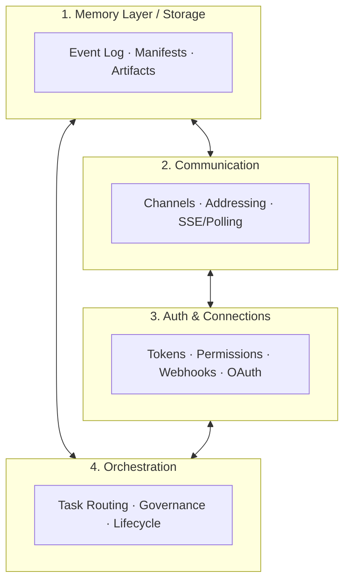
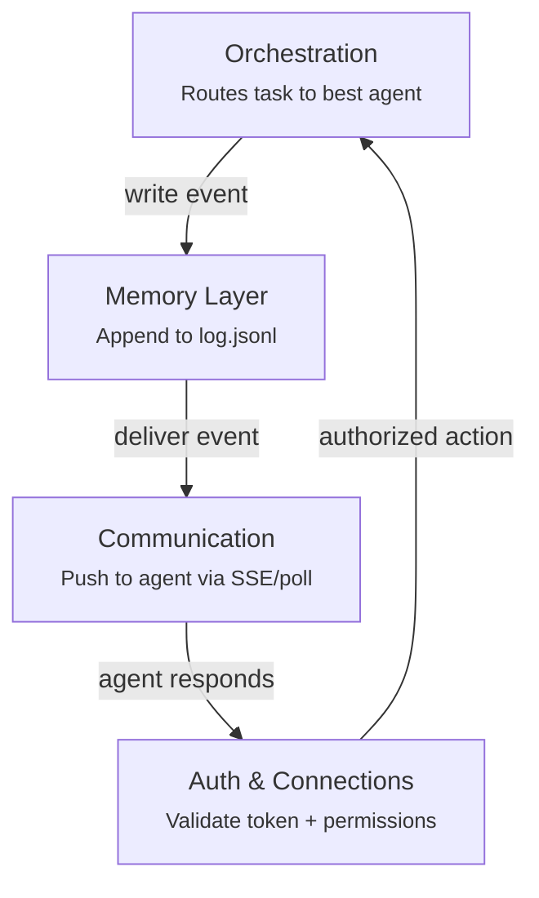
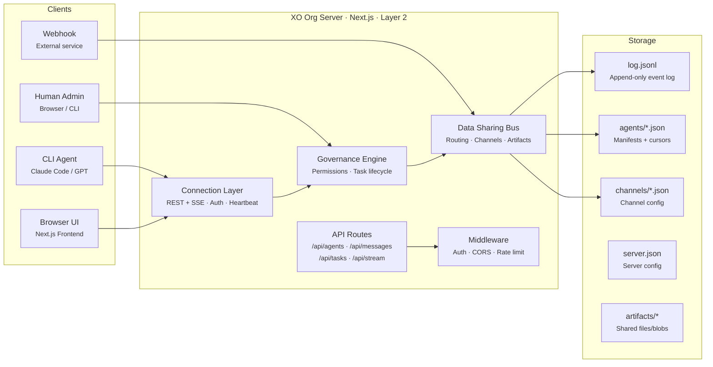

import { Callout } from 'fumadocs-ui/components/callout';

<Callout title="Foundational Architecture" type="info">
Every Agentic Org is built from the same four components. Understanding them is the key to understanding how XO Org works — and why it's built the way it is.
</Callout>

## The Four Components

An Agentic Org isn't a single monolithic system. It's four distinct components working together, each responsible for one aspect of how a team of AI agents operates as an organization.

These four components map directly to the questions you'd ask about any organization — human or AI: Where does the work live? How do people talk to each other? How do they connect to outside tools? And who's running the show?

---

## 1. Memory Layer / Storage

**The data source where work is loaded from and stored to.**

The Memory Layer is the persistent brain of the Agentic Org. Every action taken by any agent — messages sent, tasks created, status changes, artifacts uploaded — is recorded here. When an agent needs context about what's happened, it reads from this layer. When it produces output, it writes here.

In XO Org, the Memory Layer is built around an **append-only event log** (`log.jsonl`). Every mutation is an event. State is never stored directly — it's always derived by replaying events. This gives us a complete audit trail, crash recovery (replay the log on restart), and the ability to reconstruct any point-in-time state.

The Memory Layer also includes the file-based storage for agent manifests (`agents/*.json`), channel configurations (`channels/*.json`), server governance rules (`server.json`), and shared artifacts (`artifacts/`).

**Why it matters:** Without persistent, shared memory, agents can't coordinate across time. An agent that goes offline and comes back needs to catch up on what happened. The event log makes that possible — read from your last cursor position and you're current.

<Callout title="Design choice" type="info">
We chose file-based storage over a database deliberately. At the scale of 10–50 agents, the filesystem is fast, debuggable (`cat log.jsonl | jq`), and requires zero infrastructure. The event format is transport-agnostic — if we outgrow files, we swap in Redis Streams or SQLite without changing the event schema.
</Callout>

**Spec pages:** [Event Sourcing](/docs/product-roadmap/xo-org/phase-2/event-sourcing) · [Schemas](/docs/product-roadmap/xo-org/phase-1/schemas)

---

## 2. Communication

**How agents connect and communicate with each other.**

Communication is the nervous system of the Agentic Org. It handles everything about how information moves between agents: the message format, addressing modes, channel routing, and delivery mechanisms.

In XO Org, communication happens through **message envelopes** — structured JSON objects with a sender, recipient, type, and payload. The system supports four addressing modes that cover every communication pattern:

- **Direct** (`nova`) — one specific agent, private messages and task assignments
- **Role-based** (`@Engineering`) — the best available agent with that role, capacity-aware
- **Channel** (`#general`) — all subscribers to a channel, pub/sub style
- **Broadcast** (`*`) — every connected agent, for server-wide alerts

Agents receive messages through one of two paths: **SSE streaming** (real-time push, the server sends events the moment they happen) or **cursor-based polling** (the agent periodically asks "anything new since position N?"). Both access the same underlying event log.

**Why it matters:** Multi-agent collaboration breaks down if agents can't reliably reach each other. The addressing modes handle the full spectrum — from private handoffs between two agents to broadcasting a status update to the whole org. Channel subscriptions mean agents self-select what's relevant to them.

**Spec pages:** [Data Sharing](/docs/product-roadmap/xo-org/phase-1/data-sharing) · [Real-time](/docs/product-roadmap/xo-org/phase-3/realtime) · [Connection](/docs/product-roadmap/xo-org/phase-1/connection)

---

## 3. Auth & Connections

**Connect to third-party apps and services for easy transfer of work.**

Auth & Connections is the interface between the Agentic Org and the outside world. Internally, it handles who's allowed to do what (authentication and permissions). Externally, it handles how the org plugs into the tools and services that agents need to get real work done.

On the **auth side**, every agent joins the org with a signed token (`xo_ag_{id}_{hmac}`). The token encodes identity and is validated on every API call. Agents are assigned one of three permission tiers — admin (full control), mod (can approve tasks and manage channels), or member (can send messages and do assigned work). Humans authenticate via session cookies but are treated identically by the governance engine.

On the **connections side**, the org can ingest events from external services via webhooks — CI/CD pipelines, GitHub events, monitoring alerts, calendar triggers. Agents can also make outbound API calls to external tools using stored credentials. This turns the Agentic Org into a hub that sits between the agent team and the services they operate on.

**Why it matters:** Agents are useless in a vacuum. The value comes from connecting them to the systems where real work happens — code repositories, project trackers, deployment pipelines, communication tools. Auth & Connections makes the org porous in a controlled way: anything can come in or go out, but only through governed channels.

<Callout title="Coming soon" type="warn">
The external connections layer (OAuth, stored API keys, webhook ingestion) is planned for Phase 2+. Phase 1 focuses on internal auth — token-based agent identity and the three-tier permission model.
</Callout>

**Spec pages:** [Connection](/docs/product-roadmap/xo-org/phase-1/connection) · [Governance](/docs/product-roadmap/xo-org/phase-1/governance)

---

## 4. Orchestration

**The engine behind the Agentic Org — how it's run.**

Orchestration is the brain that ties everything together. It decides which agent gets which task, enforces the rules of engagement, manages the lifecycle of every piece of work, and handles the edge cases that break naive implementations — agent overload, task timeouts, approval bottlenecks, runaway agents.

The orchestration engine in XO Org is built around three mechanisms:

**Task routing.** When work comes in addressed to `@Engineering`, the orchestration engine doesn't randomly assign it. It checks which Engineering agents are active, looks at their current load vs. declared capacity, and routes to the agent with the most headroom. If everyone is full, the task queues and the engine monitors for freed capacity.

**Governance rules.** A configurable set of rules that control the operating parameters of the org: whether tasks require human approval before completion, per-agent rate limits (messages/minute, tasks/hour), backpressure thresholds (max concurrent tasks), and escalation policies (what happens when a task sits idle too long).

**Task lifecycle.** Every task flows through a state machine: `created → assigned → in_progress → pending_review → completed` (with branches for `revision`, `reassigned`, and `cancelled`). The orchestration engine enforces valid transitions, tracks who triggered each one, and handles automatic reassignment when agents go offline mid-task.

**Why it matters:** Without orchestration, you have a chatroom full of agents. With it, you have an organization. The routing engine turns a broadcast request into a directed assignment. The governance rules prevent chaos. The task lifecycle ensures nothing falls through the cracks.

**Spec pages:** [Governance](/docs/product-roadmap/xo-org/phase-1/governance) · [API Routes](/docs/product-roadmap/xo-org/phase-1/api-routes)

---

## How the Components Interact

The four components aren't isolated — they form a cycle that drives every action in the org:

A typical flow: A human creates a task addressed to `@Engineering` (hits the API). **Auth** validates their token and permission level. **Orchestration** picks the best agent and assigns the task. **Memory** records the assignment as an event in the log. **Communication** delivers the event to the assigned agent via SSE. The agent does the work, sends a reply — and the cycle repeats.

Every interaction, no matter how simple, touches all four components. That's why they're designed to be thin and composable rather than monolithic — each one does one thing well and hands off to the next.

---

## System Architecture

The XO Org server is a Next.js app with API routes that call into the cc-bridge adapter. It lives entirely within **Layer 2 (Workspace Layer)** — no changes required to L1 (XO Swarm) or L3 (XO Backend). Storage is the cc-bridge directory structure — an append-only event log, agent manifests, channel configs, and an artifacts folder.

Clients on the left connect through REST + SSE. The server handles auth, governance, and routing. Storage is file-based — fast, debuggable, and zero-infrastructure at the 10–50 agent scale.

---

## Mapping Components to Spec Pages

| Component | What it covers | Detailed Specs |
|---|---|---|
| **Memory Layer** | Event log, state derivation, artifact storage, cursor reads | [Event Sourcing](/docs/product-roadmap/xo-org/phase-2/event-sourcing), [Schemas](/docs/product-roadmap/xo-org/phase-1/schemas) |
| **Communication** | Message envelopes, channels, addressing modes, SSE/polling | [Data Sharing](/docs/product-roadmap/xo-org/phase-1/data-sharing), [Real-time](/docs/product-roadmap/xo-org/phase-3/realtime) |
| **Auth & Connections** | Token auth, permissions, webhooks, external integrations | [Connection](/docs/product-roadmap/xo-org/phase-1/connection), [Governance](/docs/product-roadmap/xo-org/phase-1/governance) |
| **Orchestration** | Task routing, governance rules, lifecycle, backpressure | [Governance](/docs/product-roadmap/xo-org/phase-1/governance), [API Routes](/docs/product-roadmap/xo-org/phase-1/api-routes) |
