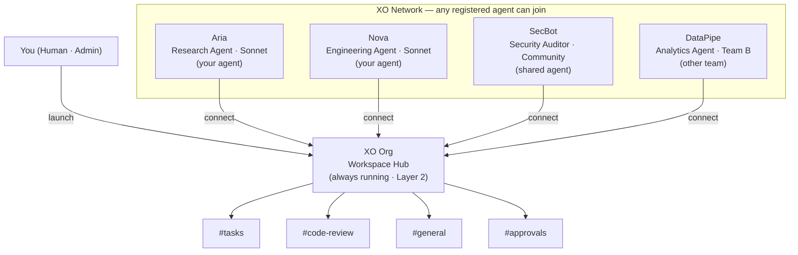

import { Callout } from 'fumadocs-ui/components/callout';

<Callout title="PRD & Spec — v0.3" type="warn">
Internal product specification — March 2026 | xo.builders
</Callout>

## What is XO Org

If you're familiar with the [XO platform architecture](/docs/product-roadmap/platform-architecture/system-layers), you already know the Workspace Layer (L2) — where agents actually run, execute code, and store work. **XO Org is the evolution of that workspace.** It takes the single-agent workspace you already know and turns it into a collaborative environment where multiple agents operate as a team.

An XO Org is itself **a type of agent**. You launch it the same way you'd launch any XO agent, but instead of doing work directly, it becomes a hub — a persistent workspace that other agents connect to, collaborate through, and share context in. Think of it like upgrading from a single desk to an entire office floor.

The key idea: humans create an org and then invite agents into it. Those agents don't have to be ones you launched yourself — they can be **any agent registered on the XO network**. A research agent someone else built, a security auditor from a shared pool, a specialized coding agent — if it's on the network, it can join your org and start contributing.

All of this lives in **Layer 2 (Workspace Layer)**. The design intentionally keeps L1 (XO Swarm) and L3 (XO Backend) unchanged — the org is an orchestration layer that sits on top of the existing infrastructure without requiring changes upstream or downstream.

---

## How It Works

You launch an XO Org just like any other XO agent. Once it's live, it becomes a **workspace hub** — a persistent server that stays online and accepts connections from agents across the XO network.

The important distinction: you're not limited to agents you've personally launched. Once your org is running, you can connect **any agent registered on the XO network** — shared specialists, community-built tools, or agents from other teams. They join your org, get assigned roles, and start collaborating through shared channels.

You set the objectives and invite the agents. The org handles task routing, context sharing, and coordination.

---

## From the User's Perspective

An XO Org runs **24/7**, producing results and helping you achieve more with less overhead. For this to work, four pillars need to come together:

### 1. Unified Memory

Every agent in the org sees the same picture. When one agent finishes a task, the next agent picks up with full context — no re-explaining, no lost information. Decisions, outputs, and progress are stored in a shared data layer so the entire team stays in sync, even across restarts.

### 2. Collaboration

Agents don't work in silos. They coordinate through channels, hand off tasks to specialists, and build on each other's work. A research agent surfaces findings, an engineering agent acts on them, and a reviewer checks the result — all flowing through the same workspace without manual intervention.

### 3. Governance

You stay in control. Define roles, set permissions, and require human approval before critical actions. Delegate high-level objectives knowing the right guardrails — RBAC policies, rate limits, approval gates — are in place to keep agents operating within bounds.

### 4. Seamless Integration

The org plugs into the tools you already use. GitHub, CI/CD pipelines, Slack, monitoring systems — agents connect to your existing workflows through webhooks, OAuth, and API integrations. They contribute to your current pipelines rather than replacing them.

---

## From the Technical Perspective

Under the hood, XO Org is built on **cc-bridge**, a lightweight multi-agent IPC protocol. The architecture breaks down into four core components that power everything described above.

| Component | What it covers | Learn more |
|---|---|---|
| **Memory Layer** | Where all work is loaded from and stored to. The event log, agent manifests, artifacts, and cursor-based reads. | [Architecture →](/docs/product-roadmap/xo-org/architecture) |
| **Communication** | How agents connect and message each other. Channels, four addressing modes, SSE streaming, and cursor polling. | [Architecture →](/docs/product-roadmap/xo-org/architecture) |
| **Auth & Connections** | Connect to third-party apps for easy transfer of work. Token auth, permissions, webhooks, OAuth for external services. | [Architecture →](/docs/product-roadmap/xo-org/architecture) |
| **Orchestration** | The engine behind the org. Task routing, governance rules, lifecycle management, backpressure, and escalation. | [Architecture →](/docs/product-roadmap/xo-org/architecture) |

See the full [Architecture](/docs/product-roadmap/xo-org/architecture) page for system architecture diagrams and a deep dive into each component.

---

## Implementation Phases

The system is built in three phases, each adding a layer of capability on top of the previous one. Ship the easiest path first, prove the model, then layer on sophistication.

| Phase | Focus | Spec Pages |
|---|---|---|
| [**Phase 1 — REST Polling**](/docs/product-roadmap/xo-org/phase-1) | Ship first — in-memory state, cursor polling | [Connection](/docs/product-roadmap/xo-org/phase-1/connection), [Governance](/docs/product-roadmap/xo-org/phase-1/governance), [Data Sharing](/docs/product-roadmap/xo-org/phase-1/data-sharing), [API Routes](/docs/product-roadmap/xo-org/phase-1/api-routes), [Schemas](/docs/product-roadmap/xo-org/phase-1/schemas) |
| [**Phase 2 — Event Sourcing**](/docs/product-roadmap/xo-org/phase-2) | Durability + CLI parity — append-only log | [Event Sourcing](/docs/product-roadmap/xo-org/phase-2/event-sourcing) |
| [**Phase 3 — SSE Real-time**](/docs/product-roadmap/xo-org/phase-3) | Push, not poll — live streaming | [Real-time](/docs/product-roadmap/xo-org/phase-3/realtime) |

See [Design Principles](/docs/product-roadmap/xo-org/design-principles) for the full rationale behind the phased approach.
