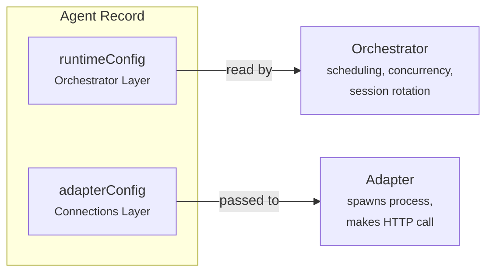
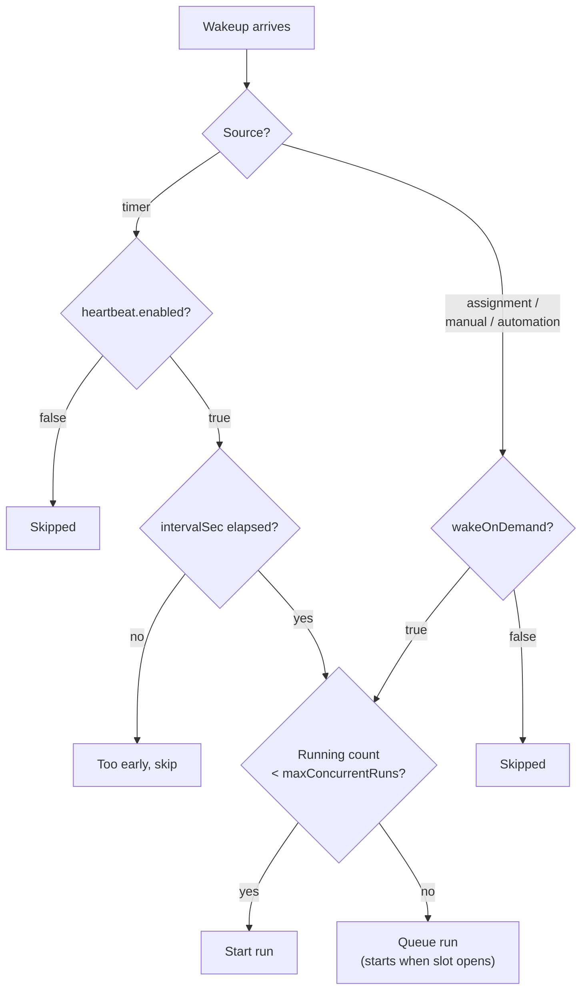
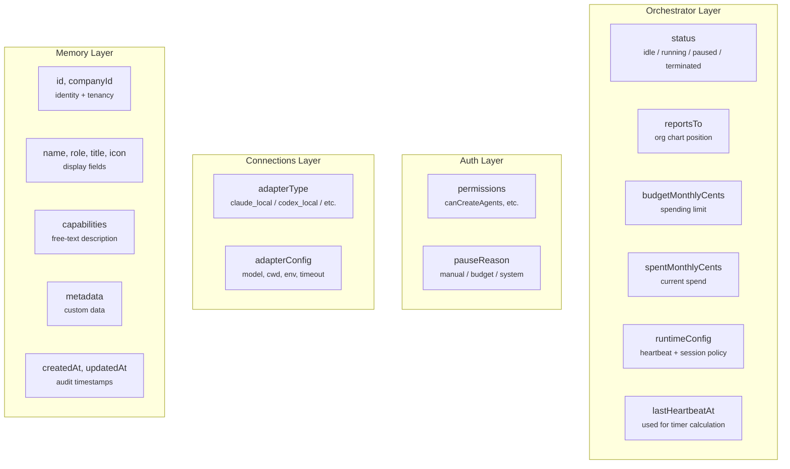

## Overview

Every agent in Paperclip has two configuration objects. Think of them as "when and whether to wake up" vs "how to actually run."



| Config | Who reads it | What it controls | Layer |
|---|---|---|---|
| `runtimeConfig` | The orchestrator | *When and whether* to wake the agent | **Orchestrator** |
| `adapterConfig` | The adapter | *How* to run the agent process | **Connections** |

---

## `runtimeConfig` — Orchestrator-Owned

This is the config that the orchestrator reads to make scheduling decisions. It's adapter-agnostic — the same fields work whether the agent is Claude, Codex, or a bash script.

### Full Example

```json
{
  "heartbeat": {
    "enabled": true,
    "intervalSec": 300,
    "wakeOnDemand": true,
    "maxConcurrentRuns": 1
  },
  "sessionCompaction": {
    "enabled": true,
    "maxSessionRuns": 200,
    "maxRawInputTokens": 2000000,
    "maxSessionAgeHours": 72
  }
}
```

### Heartbeat Policy

Controls when the agent gets invoked.

| Field | Default | What the orchestrator does with it |
|---|---|---|
| `enabled` | `true` | If false, the timer scheduler **skips** this agent entirely. It can still be woken by events. |
| `intervalSec` | `0` | Seconds between timer heartbeats. The scheduler checks: `now - lastHeartbeatAt >= intervalSec`. Zero means the timer never fires. |
| `wakeOnDemand` | `true` | If false, event-based wakeups (task assignment, manual invoke, automation) are **silently dropped**. |
| `maxConcurrentRuns` | `1` | How many heartbeat runs can execute simultaneously. If at the limit, new runs are queued instead of started. Max: 10. |

### How These Interact



### Typical Configurations by Role

**CEO — periodic review + responsive to assignments:**
```json
{
  "heartbeat": {
    "enabled": true,
    "intervalSec": 1800,
    "wakeOnDemand": true,
    "maxConcurrentRuns": 1
  }
}
```
Wakes every 30 minutes to check company status. Also wakes immediately when a task is assigned. One run at a time.

**Engineer — only works when given tasks:**
```json
{
  "heartbeat": {
    "enabled": false,
    "intervalSec": 0,
    "wakeOnDemand": true,
    "maxConcurrentRuns": 1
  }
}
```
Never wakes on a timer. Only wakes when a task is assigned or the board clicks "Run." No unnecessary compute.

**Monitoring agent — periodic checks, ignores manual pokes:**
```json
{
  "heartbeat": {
    "enabled": true,
    "intervalSec": 300,
    "wakeOnDemand": false,
    "maxConcurrentRuns": 1
  }
}
```
Wakes every 5 minutes on the timer. Ignores task assignments and manual invocations. Purely automated.

**Parallel worker — handles multiple tasks at once:**
```json
{
  "heartbeat": {
    "enabled": false,
    "intervalSec": 0,
    "wakeOnDemand": true,
    "maxConcurrentRuns": 3
  }
}
```
Up to 3 simultaneous runs. Useful for an agent that can work on independent tasks in separate workspaces.

### Session Compaction Policy

Controls when the orchestrator rotates an agent's session to prevent context window bloat.

| Field | Default | What it means |
|---|---|---|
| `enabled` | `true` | Whether compaction is active |
| `maxSessionRuns` | `200` | Rotate after this many runs on the same session |
| `maxRawInputTokens` | `2,000,000` | Rotate when cumulative input tokens exceed this |
| `maxSessionAgeHours` | `72` | Rotate when the session is older than this |

When any threshold is crossed, the orchestrator:
1. Generates a handoff summary from the previous session
2. Starts a fresh session with the summary as initial context
3. The agent continues working without realizing the session rotated

**Claude and Codex** override this with all thresholds at 0 — they manage their own context internally, so the orchestrator doesn't interfere. **Cursor, Gemini, OpenCode, Pi** use the defaults above.

---

## `adapterConfig` — Connections Layer (Not Orchestrator)

The orchestrator doesn't read this — it passes it through to the adapter. But it's useful to understand the shape so you see the full picture.

### What it Contains

The fields depend entirely on the adapter type. Here's one example per category:

**Claude agent (`claude_local`):**
```json
{
  "cwd": "/workspace/my-project",
  "model": "claude-sonnet-4-5-20250514",
  "effort": "high",
  "promptTemplate": "Work on issue {{issueId}}: {{issueTitle}}",
  "maxTurnsPerRun": 50,
  "dangerouslySkipPermissions": true,
  "env": { "ANTHROPIC_API_KEY": "sk-ant-..." },
  "timeoutSec": 900,
  "graceSec": 15
}
```

**HTTP webhook agent (`http`):**
```json
{
  "url": "https://my-agent.example.com/invoke",
  "method": "POST",
  "headers": { "Authorization": "Bearer secret123" },
  "timeoutMs": 15000
}
```

**Generic process agent (`process`):**
```json
{
  "command": "python3",
  "args": ["agent.py"],
  "cwd": "/home/agent/scripts",
  "timeoutSec": 600
}
```

### Why It's Not Your Layer

The orchestrator's decision is: "Should I wake this agent? Yes." Then it hands the `adapterConfig` blob to the Connections layer (the adapter) and says "you figure out how to run them." The orchestrator never looks at `model`, `cwd`, `command`, or any of it — those are execution details, not scheduling decisions.

---

## The Full Agent Record

For reference, here's every field on an agent and which layer owns it:



| Field | Layer | Why |
|---|---|---|
| `status` | Orchestrator | Lifecycle decisions (can this agent be invoked?) |
| `reportsTo` | Orchestrator | Org chart routing and delegation |
| `budgetMonthlyCents` / `spentMonthlyCents` | Orchestrator | Budget enforcement decisions |
| `runtimeConfig` | Orchestrator | Heartbeat scheduling + session compaction |
| `lastHeartbeatAt` | Orchestrator | Timer interval calculation |
| `permissions` | Auth | Who is allowed to do what |
| `pauseReason`, `pausedAt` | Auth | Access control (why is access blocked) |
| `adapterType` | Connections | Which adapter to use |
| `adapterConfig` | Connections | How to run the adapter |
| `id`, `companyId` | Memory | Identity and tenancy |
| `name`, `role`, `title`, `icon` | Memory | Display and identity |
| `capabilities`, `metadata` | Memory | Descriptive data |
| `createdAt`, `updatedAt` | Memory | Audit timestamps |
