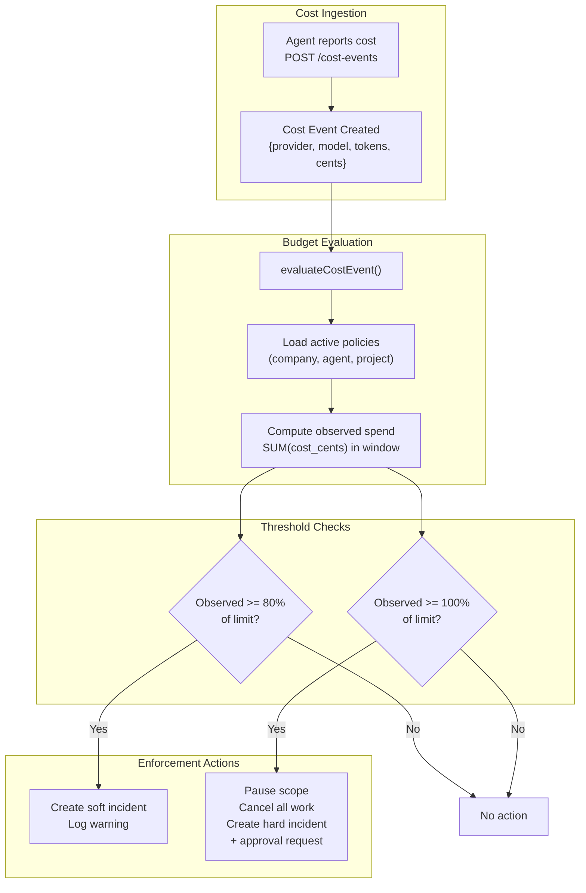
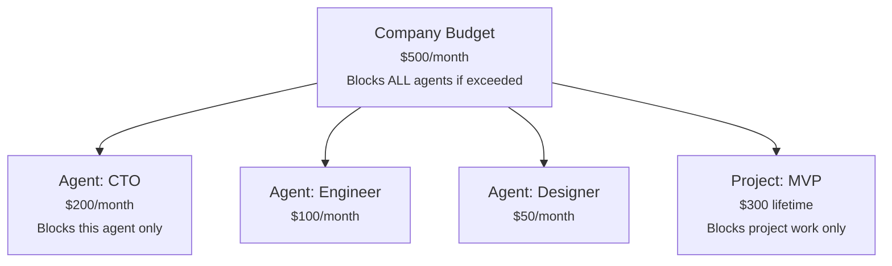
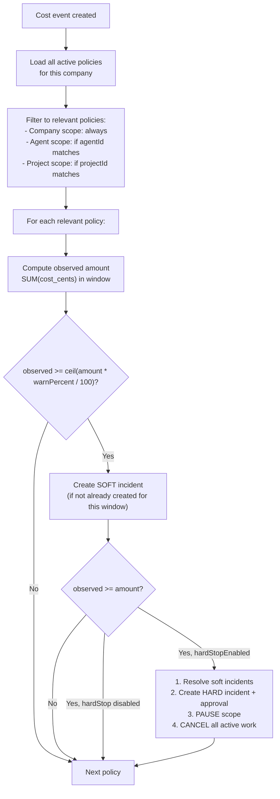
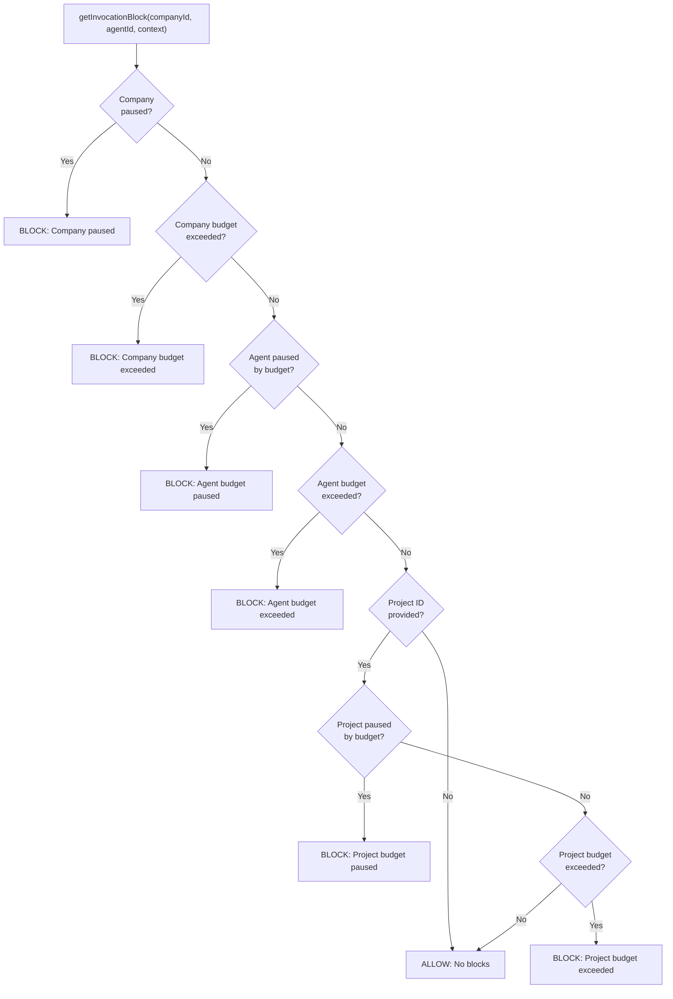
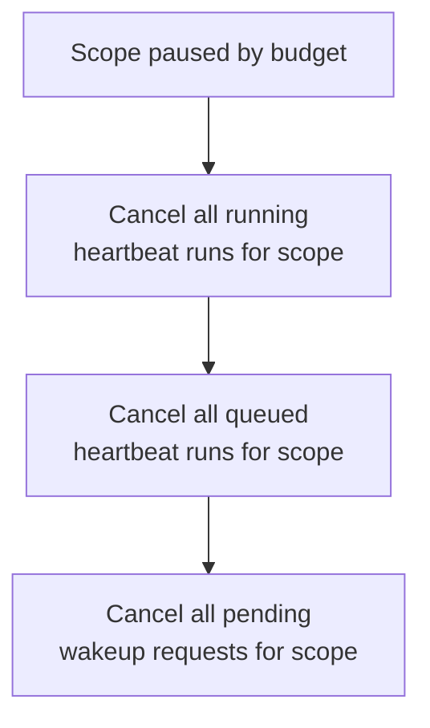
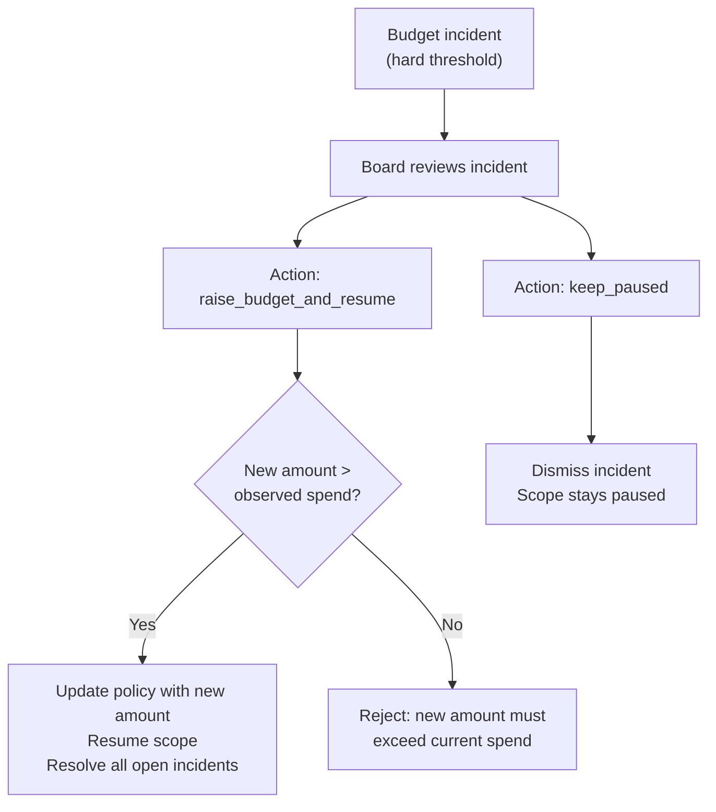

## Overview

Paperclip tracks every LLM API call's cost and enforces budget limits at three levels: company, agent, and project. When spending exceeds a hard limit, the system automatically pauses the scope, cancels active work, and creates an approval for the board to resolve.

---

## Budget Architecture



---

## Three-Level Budget Hierarchy

Budgets cascade from company down to individual agents and projects. Each level can independently block work.



### Budget Policy Model

Each budget is defined by a `budget_policy` record:

| Field | What it controls |
|---|---|
| `scopeType` | `"company"`, `"agent"`, or `"project"` |
| `scopeId` | The entity being budgeted |
| `metric` | `"billed_cents"` (only supported metric in V1) |
| `windowKind` | `"calendar_month_utc"` or `"lifetime"` |
| `amount` | Budget limit in cents |
| `warnPercent` | Soft alert threshold (default: 80%) |
| `hardStopEnabled` | Auto-pause on breach (default: true) |
| `notifyEnabled` | Create incident on soft threshold (default: true) |

**Window mechanics:** Monthly budgets use UTC calendar month boundaries (1st at 00:00:00 UTC to 1st of next month). When the month rolls over, observed spend resets naturally because the query window shifts.

---

## Cost Event Ingestion

When an agent completes an LLM API call, it reports the cost:

```
POST /companies/:companyId/cost-events
{
  "agentId": "uuid",
  "issueId": "uuid",        // optional
  "provider": "anthropic",
  "model": "claude-sonnet-4-5-20250514",
  "inputTokens": 1234,
  "outputTokens": 567,
  "costCents": 89,
  "occurredAt": "2026-02-17T20:25:00Z"
}
```

### What happens on ingestion

1. **Validate** — agent exists and belongs to company
2. **Insert** cost event record
3. **Update running totals** — recompute `spentMonthlyCents` for the agent and company
4. **Evaluate budgets** — call `evaluateCostEvent()` which checks all applicable policies

---

## Budget Evaluation Flow

`evaluateCostEvent()` is called after every cost event. It checks **all active policies** relevant to the event.



---

## Invocation Blocking

Before every heartbeat run starts, `getInvocationBlock()` checks if the agent can work:



If any check returns a block, the heartbeat run is cancelled before it starts. The block includes a human-readable reason (e.g., "Agent is paused because its budget hard-stop was reached.").

---

## Auto-Pause Behavior

When a hard budget threshold is crossed, the system takes immediate action:

### 1. Pause the scope

| Scope | What gets paused |
|---|---|
| Agent | `status = "paused"`, `pauseReason = "budget"` |
| Project | `pauseReason = "budget"`, `pausedAt = now` |
| Company | `status = "paused"`, `pauseReason = "budget"` |

### 2. Cancel active work

The heartbeat service's `cancelBudgetScopeWork()` hook fires:



For agent scope, this means the agent's running process gets SIGTERM. For company scope, ALL agents in the company get cancelled.

### 3. Create incident + approval

A `budget_incident` record is created with `thresholdType: "hard"`, and an automatic `approval` of type `budget_override_required` is created for the board to resolve.

---

## Incident Resolution

The board resolves budget incidents via the approvals UI:



### Key behavior: `pauseReason` prevents interference

The system only resumes scopes paused for budget reasons. If an admin manually paused an agent, a budget resume won't accidentally un-pause it. The `pauseReason` field (`"manual"` vs `"budget"` vs `"system"`) ensures clean separation.

---

## Cost Rollups

V1 uses read-time aggregate queries rather than materialized views:

| Endpoint | What it returns |
|---|---|
| `GET /costs/summary` | Total spend, budget, utilization % |
| `GET /costs/by-agent` | Per-agent cost breakdown with token counts |
| `GET /costs/by-provider` | Per-provider/model breakdown |
| `GET /costs/by-project` | Per-project costs (traced through runs → issues → projects) |
| `GET /costs/by-biller` | Per-billing-entity breakdown |
| `GET /costs/window-spend` | Rolling windows: 5h, 24h, 7d (by provider) |

### Real-time tracking fields

Both `agents` and `companies` tables have `spentMonthlyCents` fields that are updated on every cost event. This allows the dashboard to show current utilization without running aggregate queries.

---

## Provider Quota Windows

Adapters that support it can report provider-level rate limits back to the dashboard:

```json
{
  "provider": "anthropic",
  "ok": true,
  "windows": [
    { "label": "5h", "usedPercent": 72, "resetsAt": "2026-02-17T23:00:00Z" },
    { "label": "7d", "usedPercent": 45, "resetsAt": "2026-02-21T00:00:00Z" }
  ]
}
```

This shows not just Paperclip's own budget limits, but also the provider's rate limits — so the board can see both constraints.

---

## Finance Events (Beyond LLM Costs)

Separate from cost events, `finance_events` track broader financial transactions:

| Field | Purpose |
|---|---|
| `eventKind` | `"inference_charge"`, `"platform_fee"`, `"credit_purchase"`, etc. |
| `direction` | `"debit"` or `"credit"` |
| `amountCents` | Transaction amount |
| `biller` | Who charged |
| `estimated` | Whether this is a projected vs actual cost |

Finance events don't trigger budget enforcement — they're an accounting layer on top of cost events.

---

## Limitations

- **Single metric:** Only `billed_cents` is supported. No token-count-based budgets or per-model limits.
- **Read-time rollups:** Aggregate queries run on every request. At scale, this could need materialized rollups.
- **Monthly window only:** Calendar month UTC. No weekly, daily, or custom windows (though `lifetime` is supported for projects).
- **No forecasting:** The system reacts to spend — it doesn't predict when a budget will be exhausted.
- **Agent self-reporting:** Agents report their own costs. A malicious agent could underreport. (Mitigated by the fact that agents authenticate with API keys scoped to their identity.)
