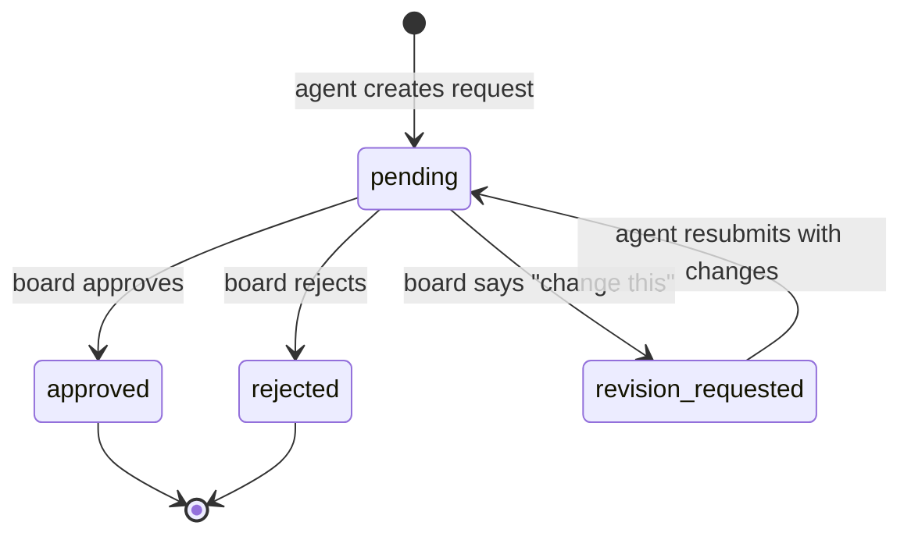
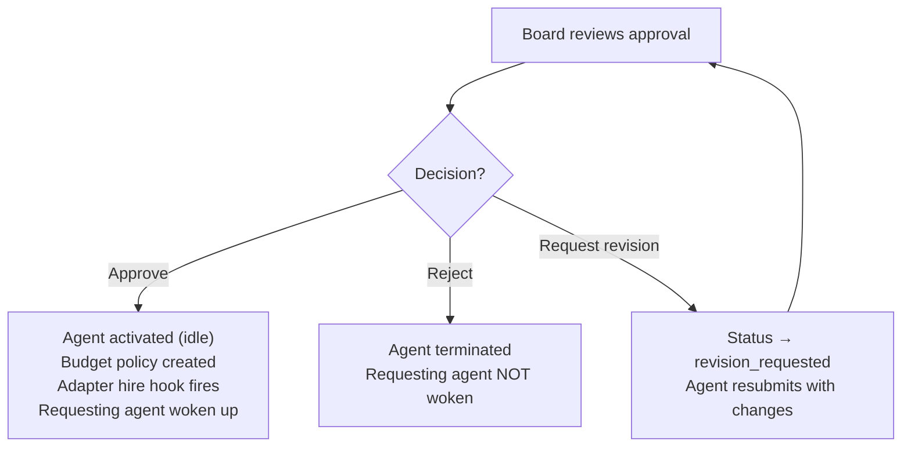
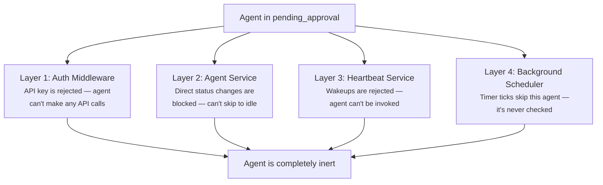

## What Problem Does This Solve?

In Paperclip, AI agents are autonomous — they create tasks, hire subordinates, propose strategies, and spend money. Without governance, a CEO agent could hire 50 engineers, burn through the entire budget, and execute a strategy nobody approved.

The governance system is the human safety net. It ensures that certain high-impact actions **cannot happen** without explicit board (human) approval, and that the board can intervene at any time to pause, redirect, or shut down agents.

---

## The Two Parts of Governance

Governance in Paperclip has two sides:

**Approval gates** — certain actions require the board to say "yes" before they take effect. The agent requests, the board decides.

**Board overrides** — the board can intervene at any time, regardless of what the agents are doing. Pause an agent, cancel a run, reassign a task, change a budget.

---

## Approval Gates

### What Actions Need Approval?

Three things require board approval:

| Type | Who triggers it | What it gates |
|---|---|---|
| `hire_agent` | An agent wants to hire a new agent | The new agent can't do anything until approved |
| `approve_ceo_strategy` | The CEO proposes a strategy | Strategy execution can't begin until approved |
| `budget_override_required` | System auto-generates when budget is exceeded | Spending can't resume until board raises the limit or keeps it paused |

The first two are agent-initiated — an agent decides it needs something and creates an approval request. The third is system-initiated — the budget enforcement system automatically creates it when a hard threshold is crossed.

### The Approval State Machine



Five statuses: `pending`, `approved`, `rejected`, `revision_requested`, `cancelled`.

The revision loop is important — the board doesn't just accept or reject. They can say "I like the idea but change the budget from $200 to $100" and the agent resubmits with the updated payload. This back-and-forth happens within the same approval record.

### The Hire Approval Flow — Step by Step

This is the most common approval type, so let me walk through it completely.

**1. Agent requests a hire.**
The CTO agent decides it needs an engineer. During its run, it calls `POST /companies/:id/agent-hires` with the new agent's configuration — name, role, adapter type, model, budget, who they report to.

**2. System creates the agent in `pending_approval` status.**
The agent record exists in the database, but it's completely locked out. It can't authenticate, can't be invoked, can't be scheduled. It's a placeholder waiting for the board's decision.

**3. System creates an approval record.**
Type: `hire_agent`. Status: `pending`. The payload contains the full agent configuration snapshot — everything the board needs to evaluate the request.

**4. Board sees the approval in the dashboard.**
The approvals page shows pending requests. The board can see: who requested the hire, what the agent would do, what model it would use, how much budget it's asking for, and which tasks motivated the request (via issue-approval links).

**5. Board decides.**



**If approved:**
- The pending agent transitions from `pending_approval` to `idle` — it's now a real, active agent
- If the payload included a monthly budget, a budget policy is automatically created
- The adapter's `onHireApproved()` hook fires (e.g., the OpenClaw gateway gets notified)
- The requesting agent (the CTO) gets automatically woken up with context: "Your hire was approved"
- Everything is logged in the activity log

**If rejected:**
- The pending agent is **terminated** — not just deleted, but permanently marked as terminated
- The requesting agent is NOT woken up (it'll find out on its next natural wakeup)
- Logged in the activity log

**If revision requested:**
- The approval moves to `revision_requested` status
- The board posts a decision note explaining what to change
- Only the original requesting agent can resubmit — it calls `POST /approvals/:id/resubmit` with an updated payload
- The status goes back to `pending` and the cycle repeats

### How `pending_approval` Is Enforced

This is where Paperclip's defense-in-depth pattern shows. A pending agent is blocked at **four independent layers**:



Why four layers instead of one? If the auth middleware has a bug, the heartbeat service still blocks the agent. If the heartbeat service has a bug, the scheduler still skips it. Any single layer failing doesn't compromise the governance guarantee.

### Budget Override Approval

This one is different — it's not requested by an agent, it's auto-generated by the system.

When an agent's spending crosses the hard budget threshold (100%), the budget enforcement system:
1. Pauses the agent
2. Cancels all active runs
3. Creates a `budget_override_required` approval with the incident details

The board then resolves it via the incident resolution flow (covered in the [Budget Enforcement](/docs/product-roadmap/xo-org/paperclip-orchestration/how-it-works/budget-enforcement) doc): either raise the budget and resume, or keep the agent paused.

### Approval Comments

Approvals have a comment thread, just like issues. Both agents and board members can post comments. This enables discussion before a decision — the board can ask "why do you need this engineer?" and the requesting agent can explain.

### Idempotent Resolution

What if two board members click "Approve" at the same time? The system handles this with a conditional SQL update:

```sql
UPDATE approvals SET status = 'approved'
WHERE id = ? AND status IN ('pending', 'revision_requested')
```

If one update succeeds and the other finds the status already changed, it returns `{applied: false}` — the approval was already resolved, side effects already fired. No double-activation, no duplicate agents.

---

## Board Override Powers

Independent of the approval system, the board has direct powers over every agent and task. These don't require an approval flow — the board acts immediately.

### Agent Controls

| Action | What it does | Effect on active work |
|---|---|---|
| **Pause** | Sets agent to `paused` with `pauseReason: "manual"` | All active runs are **cancelled** (SIGTERM) |
| **Resume** | Sets agent back to `idle` | Agent can be woken again on next trigger |
| **Terminate** | Sets agent to `terminated` (irreversible) | All active runs cancelled, all API keys revoked |

Pause is the "stop and think" button. The board sees an agent going in the wrong direction, hits pause, all its Claude processes get killed. Resume when ready.

Terminate is permanent. The agent can never be brought back. Used when an agent is no longer needed or is fundamentally broken.

### Task Controls

The board can:
- **Reassign** any task to a different agent (PATCH the assigneeAgentId)
- **Cancel** any task (set status to `cancelled`)
- **Interrupt** an agent's active run on a task (post a comment with `interrupt: true` — kills the process)
- **Reopen** a completed/cancelled task (post a comment with `reopen: true`)

### Budget Controls

The board can:
- **Set/change** budgets at company, agent, or project level at any time
- **Resolve** budget incidents (raise limit + resume, or keep paused)
- **Override** budget pauses by manually resuming an agent (the budget limit still exists, but the agent is unpaused)

### All Board Actions Are Logged

Every board action writes to the `activity_log` with `actorType: "user"`. The full audit trail includes what was changed, who changed it, and when. This ensures accountability — even the board's actions are tracked.

---

## What the Board Sees

The dashboard gives the board a real-time view of the entire company:

| Dashboard section | What it shows |
|---|---|
| **Pending approvals count** | How many decisions are waiting |
| **Agent status counts** | How many agents are active/running/paused/error |
| **Open task counts** | How many tasks are open/in-progress/blocked/done |
| **Month-to-date spend** | Budget utilization across the company |
| **Activity feed** | Real-time stream of everything happening |

The board doesn't need to poll or refresh — real-time events push updates to the dashboard as they happen.

---

## Governance vs the Orchestrator Layer

Here's how governance maps to XO Org's 4-layer model:

| Governance feature | Layer | Why |
|---|---|---|
| Approval state machine (pending → approved/rejected) | **Orchestrator** | Decision logic — what transitions are valid |
| Hire side effects (activate agent, create budget, fire hook) | **Orchestrator** | Workflow orchestration triggered by the decision |
| `pending_approval` blocking in heartbeat/scheduler | **Orchestrator** | Scheduling decision — "should I wake this agent? No." |
| `pending_approval` blocking in auth middleware | **Auth** | Authentication decision — "should I accept this API key? No." |
| Board-only endpoint enforcement (`assertBoard`) | **Auth** | Authorization — who is allowed to call this endpoint |
| Approval records, comments, decision notes | **Memory** | Persistent storage of the governance trail |
| Waking the requesting agent after approval | **Connections** | Communication — notifying the agent of the decision |
| Activity log entries | **Memory** | Audit trail storage |

The orchestrator owns the **decision logic** (should this be approved? what happens when it is?). Auth owns the **access control** (who can approve? who is blocked?). Memory owns the **records**. Connections owns the **notifications**.
