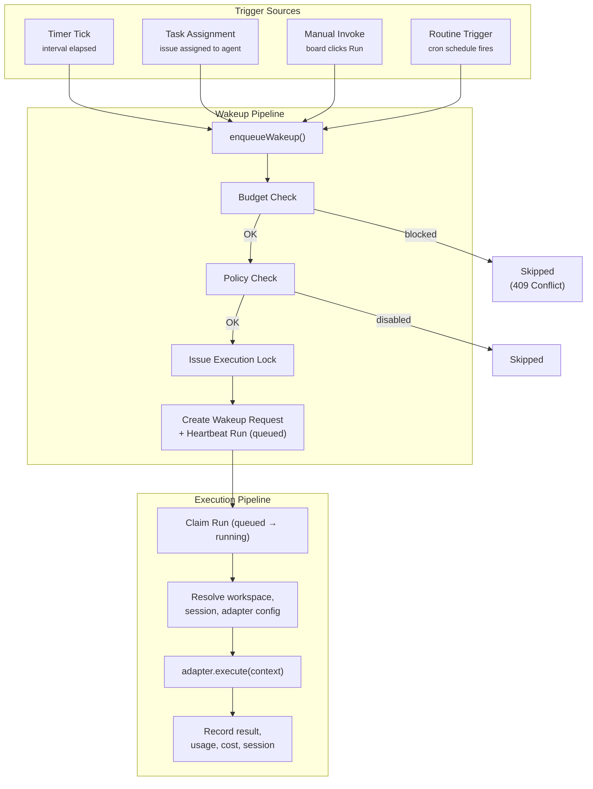
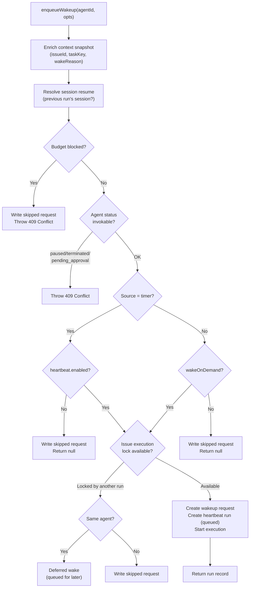
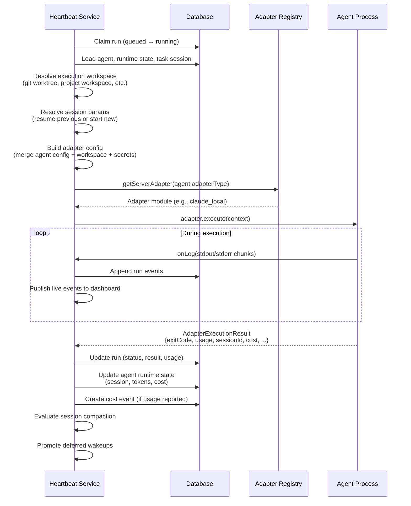
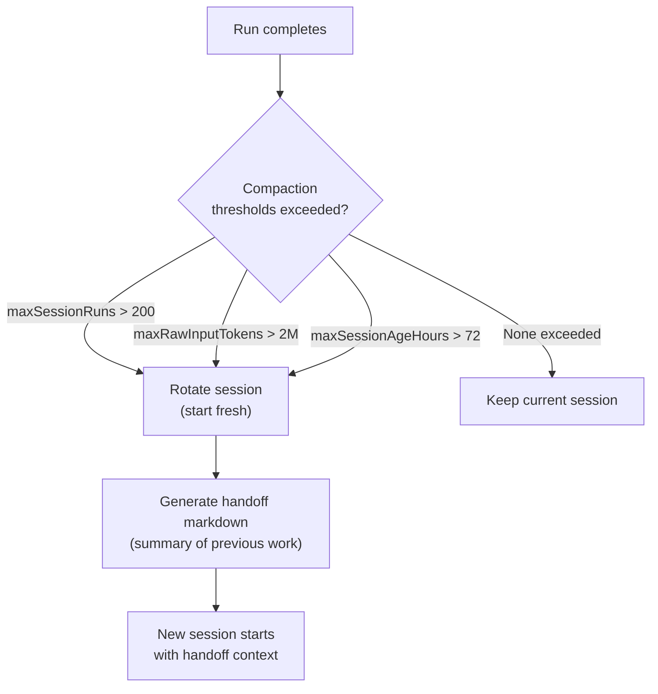
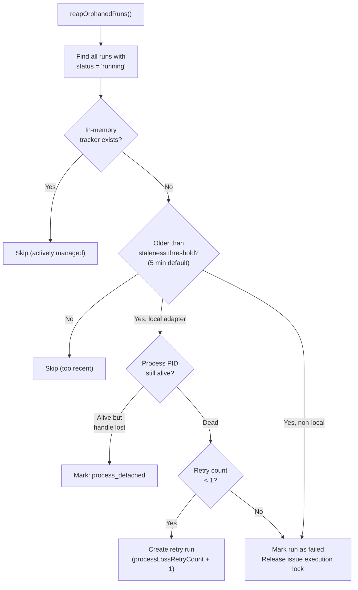
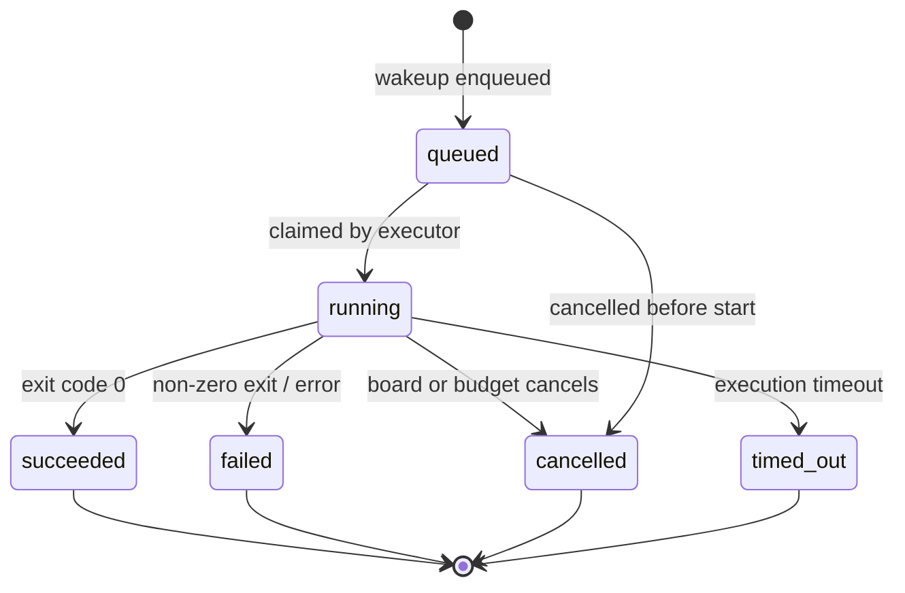

## What Problem Does This Solve?

Agents in Paperclip don't run 24/7. They're not sitting there waiting for work like a human at a desk. Instead, they're **dormant processes that get spawned when needed and die when done**. The heartbeat system is the mechanism that decides when to wake them up, tracks what happens while they're running, and cleans up when they're done or crash.

Think of it like an alarm clock system for employees who sleep until you need them.

There are really only two fundamental triggers for waking an agent:

- **Timer-based** — the agent has a configured interval, like "wake me every 5 minutes." The background scheduler checks all agents every tick, and if the interval has elapsed, the system wakes them. This is for agents that should periodically check for work — like a CEO who reviews company status every 30 minutes.
- **Event-based** — something happened that requires the agent's attention right now. A task got assigned to them, the board manually clicked "Run," or a cron routine fired. The system wakes the agent immediately in response.

Both end up calling the same function: `enqueueWakeup()`. That's the single entry point for all agent invocations.

---

## The Big Picture



---

## Wakeup Sources

| Source | When it fires | Example |
|---|---|---|
| `timer` | Heartbeat interval elapsed | Agent configured for 300s intervals, 5 minutes have passed |
| `assignment` | Task assigned to an agent | Board creates issue with `assigneeAgentId`, or agent delegates to subordinate |
| `on_demand` | Manual invocation | Board clicks "Invoke" in the agent detail page |
| `automation` | Routine or webhook trigger | Monday 9am cron fires, or external webhook received |

---

## Per-Agent Heartbeat Policy

Each agent has a heartbeat policy stored in `runtimeConfig.heartbeat`:

```json
{
  "heartbeat": {
    "enabled": true,
    "intervalSec": 300,
    "wakeOnDemand": true,
    "maxConcurrentRuns": 1
  }
}
```

| Field | Default | What it controls |
|---|---|---|
| `enabled` | `true` | Whether the timer scheduler fires for this agent |
| `intervalSec` | `0` | Seconds between timer heartbeats (0 = timer never fires) |
| `wakeOnDemand` | `true` | Whether non-timer wakeups (assignment, manual, automation) are allowed |
| `maxConcurrentRuns` | `1` | How many heartbeat runs can execute simultaneously (max: 10) |

---

## The enqueueWakeup Flow

This is the core function — every invocation goes through it. It doesn't blindly spawn the agent. It runs through a series of gates first:

1. **Enrich context** — figure out why the agent is being woken (which task, which comment, should we resume a previous session?)
2. **Budget check** — can this agent afford to work? Company/agent/project budgets are checked. If exceeded, the wake is skipped.
3. **Status check** — is the agent paused, terminated, or pending approval? If so, reject.
4. **Policy check** — for timer wakes: is `heartbeat.enabled` true? For event wakes: is `wakeOnDemand` true? If the relevant flag is off, skip silently.
5. **Issue execution lock** — is the agent already running on this same issue? If yes, coalesce instead of starting a second run.



### Wakeup Request Outcomes

| Outcome | What happened |
|---|---|
| **queued** | New heartbeat run created and execution started (or queued for `maxConcurrentRuns`) |
| **coalesced** | Merged into an existing running execution for the same agent/issue |
| **deferred** | Queued for later — will fire after the current execution completes |
| **skipped** | Rejected due to policy, budget, or status |

---

## Issue Execution Locking

When an agent is working on a task, the system prevents other wakeups from interfering with that execution. This is the "issue execution lock."

If Agent A is running on Issue #42 and a new wakeup arrives for Agent A on Issue #42, the system **coalesces** the request — it increments a counter on the wakeup request rather than starting a new run. When the current run finishes, any deferred wakes are promoted.

---

## Run Execution Pipeline

Once a heartbeat run is claimed (transitions from `queued` to `running`), the execution pipeline kicks in. This is a fixed sequence:

1. **Load everything** — agent record, runtime state (previous session, cumulative stats), and task session for the specific task
2. **Resolve workspace** — where should the agent work? Could be its default directory, a shared project workspace, or a fresh git worktree
3. **Resolve session** — should it resume a previous conversation or start fresh? Checks `agent_task_sessions` for a match. Also runs session compaction if thresholds are exceeded.
4. **Build adapter config** — merge the agent's base config with workspace overrides, secrets from the company vault, and runtime service URLs
5. **Select adapter and execute** — look up the right adapter (Claude, Codex, etc.) and call `adapter.execute()`
6. **Stream output** — while the agent runs, stdout/stderr flows back in real time to the run log and the dashboard
7. **Handle result** — when done, record everything (exit code, usage, session state, cost) and clean up



### Context Delivery Modes

| Mode | What the agent receives |
|---|---|
| `thin` | IDs and pointers only — agent fetches context via API calls |
| `fat` | Full inline payload — current assignments, goal summary, budget snapshot, recent comments |

---

## Session Management

Sessions allow agents to maintain conversation context across multiple heartbeat runs. Without sessions, every run would start from scratch.

### How Sessions Work

1. Each (agent, adapter, taskKey) tuple has an `agent_task_session` record
2. When a run completes, the adapter returns `sessionParams` and `sessionDisplayId`
3. These are persisted via the adapter's `sessionCodec.serialize()`
4. On the next run for the same task, `sessionCodec.deserialize()` restores the session
5. The adapter passes `--resume <sessionId>` (or equivalent) to the agent CLI

### Session Compaction

Long-running sessions accumulate context. Compaction rotates sessions to prevent context windows from getting too large.



**Claude and Codex** use "adapter-managed" compaction (all thresholds at 0) because they handle context management natively. **Cursor, Gemini, OpenCode, and Pi** use Paperclip-managed compaction with the default thresholds.

---

## Stuck Run Detection

The reaper runs on every scheduler tick and at startup:



### Process Liveness Check

For local adapters (Claude, Codex, Cursor, Gemini, OpenCode, Pi), the system checks if the child process PID is still running:

```
process.kill(pid, 0)  // Signal 0 = check existence, don't kill
```

- **ESRCH** (no such process) → process is dead
- **EPERM** (permission denied) → process exists but we can't signal it
- **Success** → process is alive

---

## Concurrency Control

Each agent has `maxConcurrentRuns` (default 1, max 10). The system enforces this at two levels:

1. **In-memory lock** — `withAgentStartLock()` serializes run starts per agent to prevent race conditions
2. **Database check** — counts active runs for the agent before starting a new one

When `maxConcurrentRuns` is reached, new wakeup requests create heartbeat runs in `queued` status. The `resumeQueuedRuns()` function (called every tick) checks for available slots and starts queued runs.

---

## Timer Tick Implementation

`tickTimers()` runs every scheduler interval:

```
For each agent in the database:
  1. Skip if status is paused, terminated, or pending_approval
  2. Skip if heartbeat.enabled is false or intervalSec <= 0
  3. Calculate: elapsed = now - max(lastHeartbeatAt, createdAt)
  4. Skip if elapsed < intervalSec * 1000
  5. Call enqueueWakeup(agentId, {source: "timer"})
```

This is a simple poll — it iterates all agents and checks each one. No priority queue or event-driven scheduling. For V1 with dozens of agents, this is sufficient.

**Typical configurations:**
- CEO agent: `intervalSec: 1800` (wake every 30 minutes to review company status) + `wakeOnDemand: true` (also wake when tasks are assigned)
- Engineer agent: `intervalSec: 0` (no timer — only works when given tasks) + `wakeOnDemand: true`
- Monitoring agent: `intervalSec: 300` (check metrics every 5 min) + `wakeOnDemand: false` (ignore manual pokes)

---

## Heartbeat Run States



---

## Key Constants

| Constant | Value | Purpose |
|---|---|---|
| `HEARTBEAT_MAX_CONCURRENT_RUNS_DEFAULT` | 1 | Default parallel runs per agent |
| `HEARTBEAT_MAX_CONCURRENT_RUNS_MAX` | 10 | Maximum configurable concurrent runs |
| Staleness threshold | 5 minutes | How long before an untracked run is considered orphaned |
| Process loss retry limit | 1 | Maximum automatic retries for lost processes |
| Session compaction: maxSessionRuns | 200 | Rotate session after this many runs |
| Session compaction: maxRawInputTokens | 2,000,000 | Rotate session at this token count |
| Session compaction: maxSessionAgeHours | 72 | Rotate session after this many hours |
