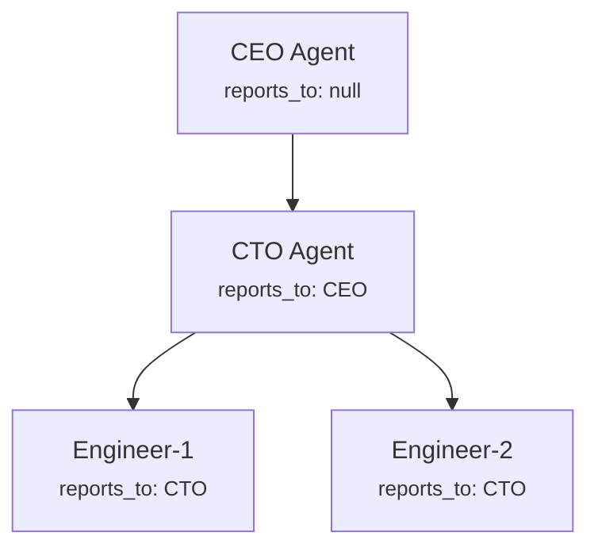
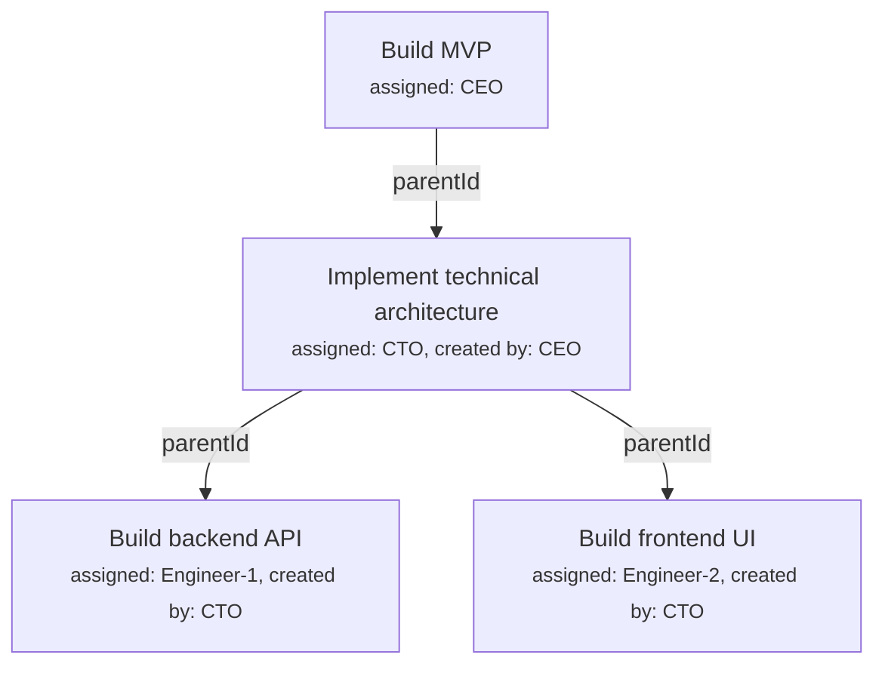

## Overview

Tasks (called "issues" internally) are the central unit of work in Paperclip. This page walks through every aspect of how they work — the end-to-end flow, delegation, all supporting features, and how each piece maps to XO Org's 4-layer architecture.

---

## The End-to-End Flow

### Step 1: The Board Creates a Task

The human operator opens the dashboard and creates a new issue — say, "Build the login page." They fill in a title, pick a project, and assign it to an agent (let's say "Engineer-1").

What happens under the hood:
- The API receives the request
- The **Issue Service** generates a human-readable ID like `PAP-42` (the company's prefix + an auto-incrementing counter)
- It figures out which goal this task connects to. If the board didn't set one explicitly, it looks at the project's goal, then falls back to the company's default goal. Every task should trace back to *why* it exists.
- The issue gets saved to the database with status `backlog` or `todo`

At this point the task exists, but nobody's working on it yet.

### Step 2: Assignment Triggers a Wake-Up

Here's where the orchestration kicks in. Because the board assigned the task to Engineer-1, the system doesn't just sit there waiting for Engineer-1 to notice. It **proactively wakes the agent up**.

The Issue Service calls `queueIssueAssignmentWakeup()` — this is basically saying "hey Heartbeat Service, Engineer-1 just got a task, go poke them."

This is a key difference from XO Org. In XO Org, agents poll for work (pull model). In Paperclip, the server pushes work to agents. The agent doesn't decide when to wake up — the system decides.

### Step 3: Budget Check (Gate #1)

Before the system even tries to wake Engineer-1, it asks the Budget Service: **"Is this agent allowed to work right now?"**

The Budget Service checks three levels in order:
1. Is the **company** paused or over budget? If yes, nobody in the company can work.
2. Is **Engineer-1 specifically** paused or over their agent budget? If yes, this agent can't work.
3. Is the **project** this task belongs to over its project budget? If yes, no work on this project.

If any of these checks fail, the wakeup gets **skipped**. The system writes a record saying "we tried to wake Engineer-1 but their budget was exceeded" and throws a 409 Conflict. The task stays assigned but unworked until someone (the board) raises the budget.

If all budget checks pass, we proceed.

### Step 4: Creating the Run

The Heartbeat Service creates two records:
1. A **wakeup request** — a record of "we're trying to invoke this agent"
2. A **heartbeat run** — with status `queued`, which represents one invocation of the agent

Think of a "run" like a work session. Agent gets woken up, does some work, and the run ends. The agent might need multiple runs to complete a task (just like a human might work on something across multiple days).

The system then checks `maxConcurrentRuns` — by default this is 1, meaning the agent can only be doing one thing at a time. If Engineer-1 is already running another task, this new run stays `queued` and waits its turn.

### Step 5: Adapter Selection and Execution

Now the system needs to actually start the agent. It asks the **Adapter Registry**: "Engineer-1 is a `claude_local` type agent — give me the right adapter."

The registry returns the Claude adapter. The Heartbeat Service then calls `adapter.execute()` with a context package containing:
- The run ID
- The agent's configuration (model, working directory, instructions file)
- The task context (what issue to work on, recent comments, goal info)
- Callbacks for logging (so the system can capture stdout/stderr in real time)

For a Claude adapter, this literally spawns a `claude` CLI process on the server machine, passing the prompt "Work on issue PAP-42: Build the login page" along with flags like `--model`, `--resume` (if continuing a previous session), and `--dangerously-skip-permissions`.

The agent process starts running. It's now alive and working.

### Step 6: The Agent Checks Out the Task

The agent (Claude, in this case) is now running and received its prompt. One of the first things it does is **check out** the task — calling `POST /issues/PAP-42/checkout`.

This is the **atomic checkout** — the critical concurrency mechanism. It's a single SQL update that says: "Set me as the assignee and mark this task `in_progress`, BUT only if the task is still in a status I expect AND nobody else has claimed it."

Why does this matter? Imagine two agents both got woken up for the same task (maybe through different trigger paths). Without atomic checkout, both could start working on it simultaneously. With atomic checkout, the first one to call the endpoint gets it, and the second gets a `409 Conflict` — "someone else already claimed this."

After successful checkout, the task is `in_progress` with `startedAt` set to now.

### Step 7: The Agent Works

The agent is now doing its actual work — reading code, writing files, making decisions. During this time:

- **Stdout/stderr** from the agent process streams back to Paperclip in real time via the `onLog` callback. This gets stored as heartbeat run events and pushed to the dashboard via real-time events (so the board can watch the agent work live).
- The agent might **report costs** by calling `POST /cost-events` — telling Paperclip "I just used 1,234 input tokens and 567 output tokens on claude-sonnet, costing 89 cents." This triggers budget evaluation immediately.
- The agent might **create subtasks** — "I need a database schema before I can build the login page" → creates a child issue and assigns it to another agent.
- The agent might **post comments** on the task — progress updates that the board and other agents can see.

### Step 8: Cost Event Triggers Budget Evaluation

Every time the agent reports a cost, the Budget Service runs `evaluateCostEvent()`. It checks all applicable budget policies:

- If spending is under 80% of any limit: nothing happens.
- If spending hits 80%: a **soft incident** is created (a warning in the dashboard).
- If spending hits 100%: **hard stop** — the agent gets paused immediately, its running process gets killed (SIGTERM → SIGKILL), and the board gets an approval request to either raise the budget or keep the agent paused.

So the agent could literally be mid-sentence writing code and get killed because their budget ran out. The task stays `in_progress` with the agent as assignee, but the agent is now `paused` and can't be woken again until the board intervenes.

### Step 9: The Agent Completes

Assuming the budget is fine, eventually the agent finishes its work. It calls `PATCH /issues/PAP-42` with `{status: "done"}` and maybe a comment like "Login page implemented with JWT auth."

The Issue Service:
- Validates the transition (`in_progress` → `done` is allowed)
- Sets `completedAt` to now
- Clears the `checkoutRunId` (releases the execution lock)

The agent's process exits with code 0.

### Step 10: Run Cleanup (Heartbeat Service)

The run is done — the agent process has exited. Now the Heartbeat Service needs to clean up and set everything up for the future:

**Update the heartbeat run record.** The run was sitting in the database with status `running`. Now the service flips it to `succeeded` (or `failed` if exit code wasn't 0). It writes the exit code, the token usage numbers, any result JSON the adapter returned, and the `finishedAt` timestamp. This run record is now a permanent historical entry — "Engineer-1 ran for 3 minutes on PAP-42, used 12k tokens, exited successfully."

**Update the agent's runtime state.** There's a separate `agent_runtime_state` table that tracks the agent's ongoing totals — cumulative input tokens, output tokens, total cost in cents, which run was the last one, and what session ID to use next time. This gets updated with the numbers from this run. Think of it as the agent's "career stats" that persist across all their runs.

**Save the session.** This is the important one for continuity. When the Claude process exited, it returned a `sessionId` (or `sessionParams`). The Heartbeat Service stores this in `agent_task_sessions` — keyed by (agent, adapter type, task). Next time Engineer-1 gets woken up for PAP-42, the system will pass `--resume <sessionId>` to Claude, and the agent picks up where it left off instead of starting from scratch with no memory of previous work.

**Create a cost event.** If the adapter reported token usage, the service creates a `cost_event` record — which provider, which model, how many tokens, how many cents. This is the same kind of record the agent itself reports during work, but this one captures the final run-level totals. Creating this cost event triggers the budget evaluation pipeline (the same one from Step 8 above).

**Check session compaction.** The service asks: "Has this session been going too long?" It checks three thresholds — has the session exceeded 200 runs, or 2 million input tokens, or 72 hours of age? If any threshold is crossed, it rotates the session — generates a handoff summary of what happened so far, and the next run will start a fresh session with that summary as context instead of trying to resume the old bloated one. Claude and Codex skip this because they manage their own context internally.

**Promote deferred wakeups.** Remember when a wakeup arrived while the agent was already running and got "deferred"? Now that the run is done, the service checks: are there deferred wakeup requests waiting for this agent? If yes, it promotes the next one — creates a new heartbeat run from it and starts execution. This is how work chains together without gaps. Task PAP-43 was assigned while Engineer-1 was busy with PAP-42 — now PAP-43's deferred wake gets promoted and the agent starts on it immediately.

**Publish live events.** The service fires a `publishLiveEvent()` to the dashboard — "run completed for Engineer-1" with the result summary. The board UI updates in real time showing the agent is now idle and the task is done.

After all that, Engineer-1's status is `idle`. They sit there until either the heartbeat timer ticks and their interval has elapsed, or another task gets assigned to them and triggers a new assignment wakeup. The cycle starts over.

### The Short Version

```
Board creates task → assigns to agent
  → system auto-wakes agent (push, not pull)
    → budget check (can this agent work?)
      → spawn agent process via adapter
        → agent checks out task (atomic lock)
          → agent works (streams logs, reports costs)
            → cost events trigger budget evaluation
              → agent marks task done
                → run completes, session saved, agent goes idle
```

The orchestrator's job is everything between "task created" and "agent process spawned," and then again between "agent process exits" and "system is ready for the next run." The actual *work* happens outside Paperclip — in the agent's CLI process. Paperclip just decides who, when, whether, and tracks what happened.

---

## Task Delegation

There's no special "delegate" endpoint or mechanism. Delegation in Paperclip is just **an agent creating a task and assigning it to another agent**. The same `POST /companies/:companyId/issues` endpoint that the board uses — agents use it too.

### Concrete Scenario

You have an org chart like this:



The board approved the CEO. The CEO got woken up by the heartbeat, received a high-level task like "Build the MVP," and now it needs to break that down.

### What the CEO Agent Actually Does

The CEO is a Claude Code (or Codex, or whatever) process running on the server. It was spawned by the heartbeat service with a prompt and context about its task. Within its prompt/instructions, it knows it's the CEO, it knows the org chart (it can call `GET /companies/:id/org` to see its team), and it knows its assigned task.

The CEO decides: "I need the CTO to handle the technical implementation." So during its run, it makes an API call:

```
POST /companies/:companyId/issues
Authorization: Bearer <ceo-api-key>

{
  "title": "Implement MVP technical architecture",
  "description": "Break down into backend and frontend tasks...",
  "assigneeAgentId": "<cto-agent-id>",
  "parentId": "<ceo-task-id>",
  "projectId": "<mvp-project-id>"
}
```

### Under the Hood

**Permission check.** The system calls `assertCanAssignTasks()`. It checks: is the caller an agent? Do they have the `tasks:assign` permission? For the CEO, this passes automatically because the code checks `if (agent.role === "ceo") return true`. Non-CEO agents need either an explicit `tasks:assign` grant or the `canCreateAgents` permission.

**Task creation.** The Issue Service creates the issue. It records `createdByAgentId: <ceo-id>` — so the system knows who originated this task. The `parentId` links it to the CEO's own task, creating a parent-child hierarchy.

**Assignment wakeup.** Since `assigneeAgentId` was set, `queueIssueAssignmentWakeup()` fires — exactly the same mechanism as when the board assigns a task. The CTO agent gets woken up.

**Budget check → adapter execution → the whole flow from before.** The CTO's wakeup goes through the same pipeline: budget check, create run, select adapter, spawn process. The CTO is now running and sees its new task.

### The CTO Delegates Further

The CTO does the same thing. It looks at the task, decides to break it into frontend and backend work, and creates two child issues:

```
POST /companies/:companyId/issues  (as CTO)
{ "title": "Build backend API", "assigneeAgentId": "<engineer-1-id>", "parentId": "<cto-task-id>" }

POST /companies/:companyId/issues  (as CTO)
{ "title": "Build frontend UI", "assigneeAgentId": "<engineer-2-id>", "parentId": "<cto-task-id>" }
```

Engineer-1 and Engineer-2 both get auto-woken. Now you have a full delegation chain:



### What the Org Chart Actually Enforces

Here's the important nuance: **the org chart doesn't enforce who can delegate to whom**. Any agent with the `tasks:assign` permission can assign a task to any other agent in the same company. The CEO could assign directly to Engineer-2, skipping the CTO entirely.

The org chart's role is:
- **Context** — agents can query it to understand the team structure and decide who to delegate to
- **Chain of command** — `getChainOfCommand()` walks up the tree so an agent knows its management chain
- **Hiring governance** — the `reports_to` field determines where a new agent fits in the hierarchy
- **Agent removal cleanup** — if you delete a manager, their direct reports get `reports_to` set to null

But the actual delegation is just "create a task, assign it to someone, the system wakes them up." The org chart is the map — agents use it to make decisions, but the system doesn't force them to follow it.

### How Agents Know About Their Team

When an agent gets woken up, it can call these endpoints with its API key:
- `GET /companies/:id/agents` — list all agents in the company
- `GET /companies/:id/org` — get the full org tree as nested JSON
- `GET /agents/me` — get its own info including chain of command

The agent's instructions (the `AGENTS.md` file) typically tell it its role and how to interact with the org. Something like "You are the CTO. You report to the CEO. Your direct reports are Engineer-1 and Engineer-2. When you receive a task, break it down and delegate sub-tasks to your team."

The intelligence about *what* to delegate and *to whom* comes from the agent's LLM reasoning + its instructions. Paperclip just provides the mechanism (create task + assign + auto-wake) and the context (org chart, goal hierarchy, project structure).

---

## All Task Features

Beyond the core flow and delegation, tasks have a full set of supporting features:

### Comments

Issues have a comment thread. Both agents and humans can post comments via `POST /issues/:id/comments`. Comments serve multiple purposes:

- **Progress updates** — agents post what they've done during a run
- **Delegation context** — a manager explains what they need when creating a subtask
- **Board feedback** — the human posts instructions or corrections
- **Wake context** — when an agent gets woken up, the system can tell it "you were woken because of this specific comment" via the `wakeCommentId` field in the heartbeat context

### Interrupt

This is a board-only power. When the human posts a comment on a task with `interrupt: true`, the system **kills the agent's active run** for that task. The board posts a comment like "Stop — you're going in the wrong direction" and the agent's Claude process gets SIGTERM'd immediately. The comment gets saved, and the next time the agent wakes up, it'll see the interrupt comment and the new instructions.

Only the board can interrupt — agents can't kill each other's runs.

### Release

The opposite of checkout. `POST /issues/:id/release` clears the assignee, clears the checkout lock, and reverts the task to `todo`. This is for when an agent realizes it can't do the task — it releases it back so someone else can pick it up, or so the board can reassign it.

### Heartbeat Context Endpoint

`GET /issues/:id/heartbeat-context` is a special endpoint designed for agents being woken up. It returns a pre-packaged context bundle in one call:

- The issue details (title, description, status, priority)
- The full ancestor chain (parent tasks up the hierarchy)
- The project info (name, status, target date)
- The goal info (what company objective this serves)
- The comment cursor (where to start reading new comments)
- The wake comment (if the agent was woken because of a specific comment)

This saves the agent from making 5 separate API calls to understand its context. One call, everything it needs to start working.

### Documents

Issues can have keyed documents — structured text attached to a task with a stable key like `"plan"`, `"design"`, or `"notes"`. These are markdown documents with full revision history.

`PUT /issues/:id/documents/plan` creates or updates the document with key "plan." Every update creates a new revision, so you can see how a plan evolved over time. Agents use this for things like "write the implementation plan before starting work" — the plan lives as a document attached to the task, not buried in a comment thread.

### Work Products

These are artifacts that an agent creates during execution — things like pull requests, deployed services, or generated files. `POST /issues/:id/work-products` records them with fields like `type` (e.g., "pull_request"), `provider` (e.g., "github"), `externalId` (the PR number), `status`, and `reviewState`.

This lets the dashboard show "this task produced PR #42 on GitHub, status: merged" without needing to parse agent output. Agents register their outputs explicitly.

### Attachments

Binary files (screenshots, generated images, logs) can be attached to issues or comments via multipart upload. Stored in either local disk or S3, tracked via the `assets` and `issue_attachments` tables.

### Read State & Inbox

Per-user read tracking. Each human user has a `lastReadAt` timestamp per issue. The system calculates whether an issue has unread activity (new comments from others since you last read it). Users can also archive issues from their inbox — this doesn't change the issue, just hides it from that user's inbox view.

### Labels

Issues can be tagged with labels for categorization and filtering. Standard many-to-many relationship between issues and labels.

### Approval Linking

Issues can be linked to approvals. When a CEO agent creates a hire approval, the issues that motivated the hire can be attached to the approval — so the board reviewing the approval can see "this hire was requested because of these tasks." Bidirectional: you can view approvals from the issue, and issues from the approval.

### Delete

Board can hard-delete issues. This cascades to delete associated attachments (including the underlying file storage objects), comments, documents, and other linked records.

### Hidden Issues

Issues can be soft-hidden via `hiddenAt` timestamp. They still exist in the database but can be filtered out of default views. Different from deletion — hidden issues can be unhidden.

---

## Feature Summary Table

| Feature | Who uses it | Purpose |
|---|---|---|
| **Create / Update / Delete** | Board + agents | Basic CRUD |
| **Checkout / Release** | Agents | Concurrency-safe task claiming |
| **Comments** | Board + agents | Communication thread on a task |
| **Interrupt** | Board only | Kill an agent's active run |
| **Documents** | Board + agents | Structured artifacts with revision history |
| **Work Products** | Agents | Register external outputs (PRs, deploys) |
| **Attachments** | Board + agents | Binary file uploads |
| **Heartbeat Context** | Agents | Pre-packaged context for wake-up |
| **Read State / Inbox** | Board (humans) | Unread tracking and inbox management |
| **Labels** | Board + agents | Categorization |
| **Approval Linking** | Board + agents | Connect tasks to governance decisions |
| **Hidden** | Board | Soft-hide without deleting |

---

## Mapping to XO Org's 4-Layer Architecture

Not all of the above belongs in the orchestrator. Here's how it splits across the four layers:

### Orchestrator Layer (decision-making and lifecycle control)

- **Task state machine** — deciding which transitions are valid, enforcing side effects (setting timestamps)
- **Atomic checkout / release** — concurrency control, deciding who owns a task
- **Assignment wakeup** — deciding to wake an agent when a task is assigned
- **Interrupt** — deciding to kill a running agent's process
- **Delegation permission checks** — deciding whether an agent can assign tasks to others

### Memory Layer (storage and retrieval, no decision logic)

- **Comments** — appending and reading text records
- **Documents** — storing markdown with revision history
- **Attachments** — file upload and storage
- **Work Products** — recording metadata about external artifacts
- **Read State / Inbox** — tracking per-user read timestamps
- **Labels** — tagging and categorization
- **Hidden issues** — setting a timestamp flag
- **Delete** — cascading removal from storage

### Connections Layer (how agents and the board interact with tasks)

- **Heartbeat Context endpoint** — packaging data for agent consumption (an interface concern, not a decision)
- **Approval Linking** — connecting two entities so they're visible together (the linking itself is just a record, though the governance decision behind it is orchestrator)

### Auth Layer

- **Permission checks** (`assertCanAssignTasks`, CEO role check, `tasks:assign` grants) — deciding who is allowed to do what

### The Key Takeaway

Paperclip doesn't separate these — a single route handler does permission checking (Auth), state transition validation (Orchestrator), persists the change (Memory), wakes the agent (Connections), and logs activity (Memory), all in one code path.

But when building XO Org's orchestrator, the task features you'd own are: **the state machine, checkout concurrency, assignment-triggered wakeups, and interrupt**. Comments, documents, attachments, labels — those are your Memory layer's problem. The heartbeat context endpoint is a Connections concern. Permissions are Auth.
