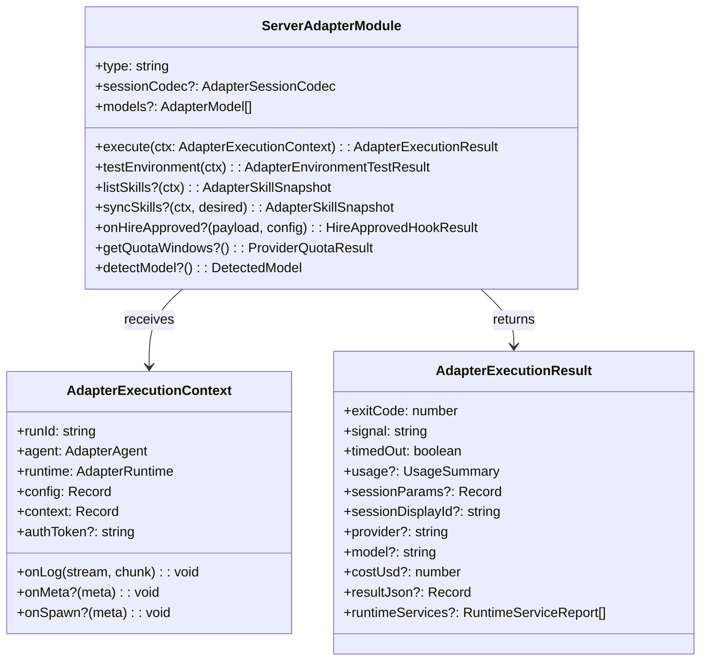
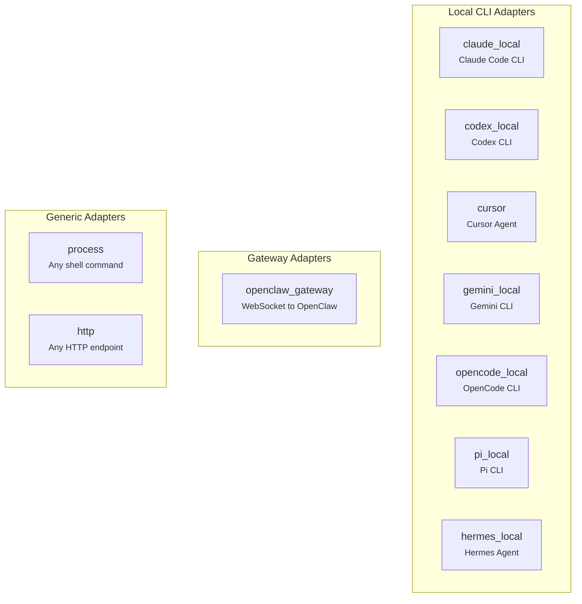
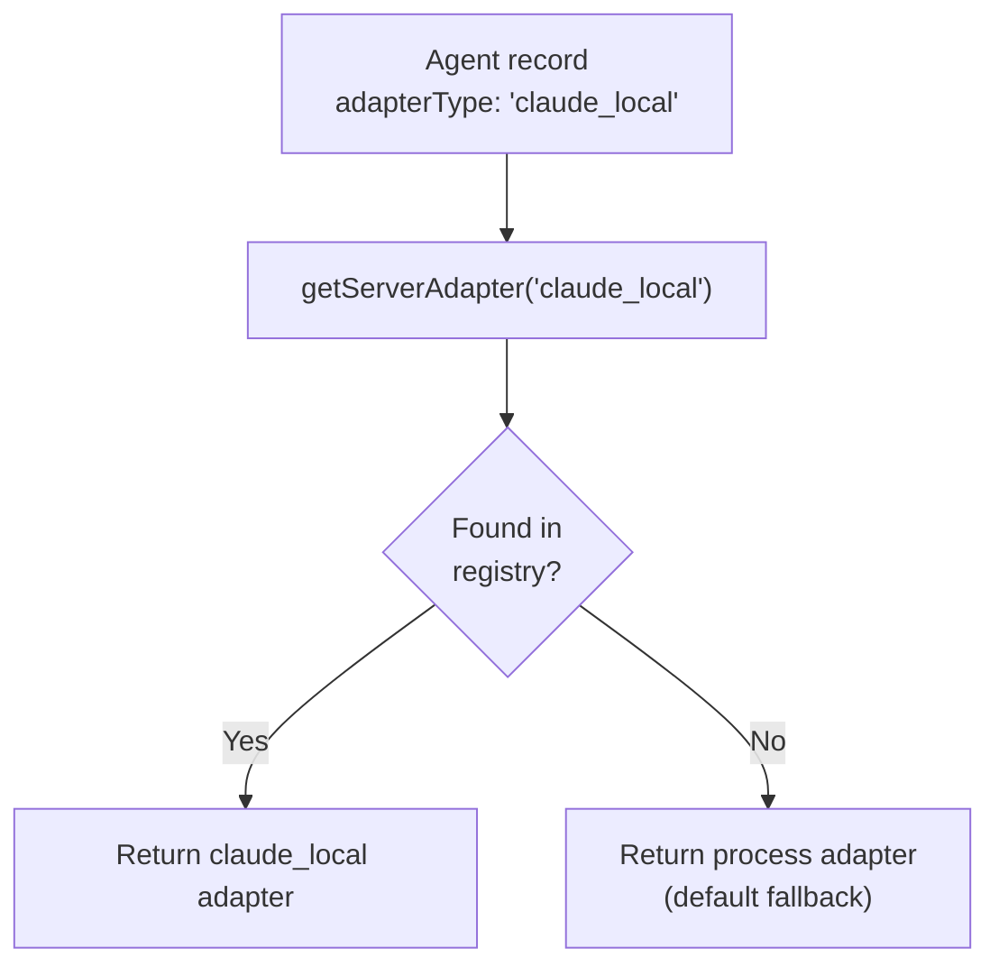
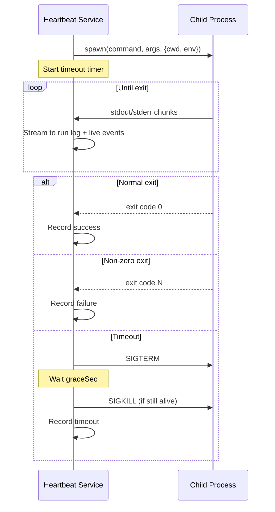
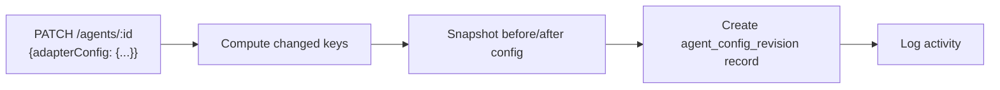
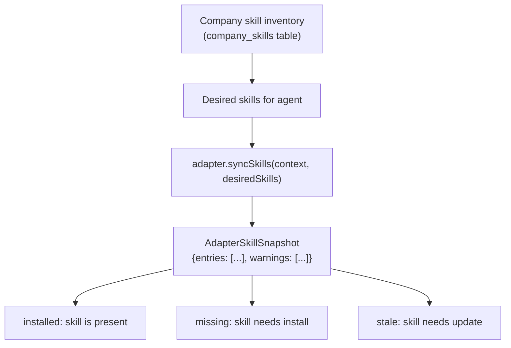

## Overview

Paperclip doesn't run agents directly. It invokes them through **adapters** — a pluggable interface that bridges the control plane and external agent runtimes. Each adapter knows how to spawn a specific agent type (Claude Code, Codex, Cursor, etc.), pass it context, capture output, and report results.

The adapter system is what makes Paperclip agent-agnostic. If it can receive a heartbeat, it's hired.

---

## Adapter Interface

Every adapter implements the `ServerAdapterModule` interface:



### Key methods

| Method | Required? | What it does |
|---|---|---|
| `execute()` | Yes | Run the agent — spawn process, make HTTP call, etc. |
| `testEnvironment()` | Yes | Verify the adapter's dependencies are available (e.g., CLI installed) |
| `listSkills()` | Optional | List skills available for this adapter type |
| `syncSkills()` | Optional | Install/remove skills on the agent's environment |
| `sessionCodec` | Optional | Serialize/deserialize session state for run resumption |
| `onHireApproved()` | Optional | Lifecycle hook when an agent is approved — e.g., notify external gateway |
| `getQuotaWindows()` | Optional | Report provider rate limits to the dashboard |
| `detectModel()` | Optional | Auto-detect the configured model from local config files |

---

## Registered Adapters

Paperclip ships with 10 adapters:



### Adapter Details

| Adapter | Type | Spawns | Session | Skills | Quota |
|---|---|---|---|---|---|
| Claude Code | `claude_local` | `claude` CLI | Native | Yes | Yes |
| Codex | `codex_local` | `codex` CLI | Native | Yes | Yes |
| Cursor | `cursor` | `agent` CLI | Paperclip-managed | Yes | No |
| Gemini | `gemini_local` | `gemini` CLI | Paperclip-managed | Yes | No |
| OpenCode | `opencode_local` | `opencode` CLI | Paperclip-managed | Yes | No |
| Pi | `pi_local` | `pi` CLI | Paperclip-managed | Yes | No |
| Hermes | `hermes_local` | External pkg | Native | Yes | No |
| OpenClaw | `openclaw_gateway` | WebSocket | No | No | No |
| Process | `process` | Any command | No | No | No |
| HTTP | `http` | HTTP POST | No | No | No |

**"Native" session** means the agent CLI handles context management internally (Claude and Codex manage their own context windows). **"Paperclip-managed" session** means Paperclip rotates sessions based on configurable thresholds.

---

## How Adapters Are Selected

The adapter registry is a simple `Map<string, ServerAdapterModule>`:



Unknown adapter types fall back to the **process adapter**. This means any command that can be spawned as a child process will work — you don't need a dedicated adapter.

---

## Process Adapter (Generic)

The simplest adapter — spawns a child process and captures output.

### Configuration

```json
{
  "command": "/usr/bin/python3",
  "args": ["agent.py", "--task", "{{taskId}}"],
  "cwd": "/home/agent/workspace",
  "env": { "API_KEY": "..." },
  "timeoutSec": 900,
  "graceSec": 15
}
```

### Execution Flow



### Graceful Shutdown

1. Send SIGTERM
2. Wait `graceSec` seconds (default 15)
3. If still running, send SIGKILL

---

## HTTP Adapter (Webhook)

Invokes an agent by making an outbound HTTP request.

### Configuration

```json
{
  "url": "https://my-agent.example.com/invoke",
  "method": "POST",
  "headers": { "Authorization": "Bearer ..." },
  "payloadTemplate": { "agentId": "{{agent.id}}", "runId": "{{run.id}}" },
  "timeoutMs": 15000
}
```

### Behavior

- Builds JSON body from template merged with agent/run context
- 2xx response = success (exit code 0)
- Non-2xx = failure
- Timeout via AbortController

---

## Local CLI Adapters (Claude, Codex, Cursor, etc.)

All local CLI adapters follow a similar pattern. Here's Claude as the reference:

### Configuration (claude_local)

```json
{
  "cwd": "/workspace/my-project",
  "instructionsFilePath": "/workspace/AGENTS.md",
  "model": "claude-sonnet-4-5-20250514",
  "effort": "high",
  "chrome": false,
  "promptTemplate": "Work on issue {{issueId}}: {{issueTitle}}",
  "maxTurnsPerRun": 50,
  "dangerouslySkipPermissions": true,
  "command": "claude",
  "extraArgs": "--verbose",
  "env": { "ANTHROPIC_API_KEY": "sk-..." },
  "timeoutSec": 900,
  "graceSec": 15
}
```

### How a Claude run executes

1. **Build command:** `claude --model claude-sonnet-4-5-20250514 --effort high -p "Work on issue PAP-42: Implement auth" --output-format stream-json`
2. **Add flags:** `--dangerously-skip-permissions`, `--resume <sessionId>` (if resuming), `--allowedTools`, etc.
3. **Set environment:** Merge agent's `env` with Paperclip variables (`PAPERCLIP_API_URL`, `PAPERCLIP_RUN_ID`, auth token)
4. **Spawn process** in the configured `cwd`
5. **Parse streaming JSON output** for transcript entries, usage stats, session IDs
6. **On completion:** Extract `exitCode`, `usage`, `sessionId`, `costUsd` from the result

### Session Resume

When resuming a previous session:
```
claude --resume abc123def --model claude-sonnet-4-5-20250514 -p "Continue working..."
```

The `sessionCodec` for each adapter handles serializing session params (sessionId, cwd, workspaceId, repoUrl, repoRef) and deserializing them for the next run.

---

## Agent Config Revisions

Every change to an agent's `adapterConfig` is tracked:



Revision records include:
- `beforeConfig` / `afterConfig` — full config snapshots
- `changedKeys` — which fields changed
- `source` — `"patch"`, `"rollback"`, `"skill-sync"`
- `createdByAgentId` / `createdByUserId` — who made the change

### Rollback

The board can rollback to a previous config revision. The system creates a new revision record (source: `"rollback"`) pointing to the restored revision, maintaining a complete audit trail.

---

## Skills System

Adapters that support skills (Claude, Codex, Cursor, Gemini, OpenCode, Pi) can have company-managed skills synced to their environment.



Skills can be:
- **company_managed** — managed by the company, synced to agents
- **paperclip_required** — required by Paperclip itself (e.g., the XO Org integration skill)
- **user_installed** — installed by the human operator
- **external_unknown** — found on the agent but not managed by Paperclip

---

## Agent Instructions

Each agent gets instructions via a managed bundle system. Instructions are organized as a directory of markdown files:

```
~/.paperclip/instances/default/agent-instructions/<agentId>/
  AGENTS.md          # Entry file (default)
  context.md         # Additional context
  workflows/
    code-review.md
```

The bundle system supports two modes:
- **managed** — Paperclip manages the instruction files
- **external** — Instructions point to an external file path (e.g., a repo's `AGENTS.md`)

Instructions are passed to the adapter via `--instructions-file` or equivalent CLI flag.

---

## Adapter Lifecycle Hooks

### onHireApproved

When an agent is approved (via hire request or join request), the adapter's `onHireApproved()` hook fires. This allows adapters to perform setup — for example, the OpenClaw gateway adapter can send a callback to the gateway notifying it that the agent was approved.

Failures are non-fatal — the approval still succeeds even if the hook fails.

### Environment Testing

`testEnvironment()` validates that the adapter's dependencies are available:

```json
{
  "adapterType": "claude_local",
  "status": "pass",
  "checks": [
    { "code": "cli_installed", "level": "info", "message": "claude CLI found at /usr/local/bin/claude" },
    { "code": "api_key", "level": "info", "message": "ANTHROPIC_API_KEY is set" }
  ]
}
```

Status can be `"pass"`, `"warn"`, or `"fail"`. The board UI shows these results so operators can diagnose agent configuration issues.

---

## Limitations

- **Local-only for most adapters:** Claude, Codex, Cursor, Gemini, OpenCode, and Pi adapters spawn local CLI processes. The agent CLI must be installed on the Paperclip server machine.
- **No remote agent pools:** V1 doesn't support dispatching work to remote machines. The OpenClaw gateway adapter is the exception — it communicates via WebSocket.
- **Single-server affinity:** Since adapters spawn local processes, agents are tied to the server they're configured on. No multi-server load balancing.
- **Process adapter is the escape hatch:** Any CLI tool or script works via the process adapter, but you lose session management, skill sync, and quota reporting.
