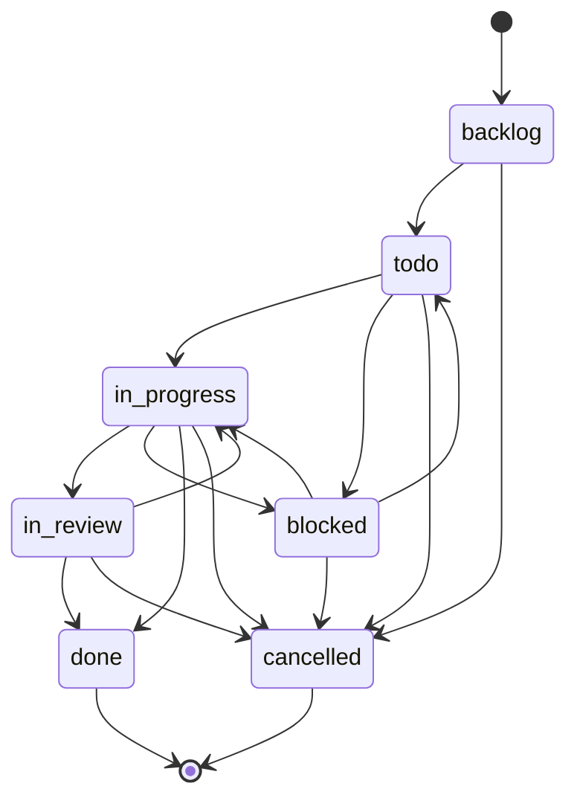
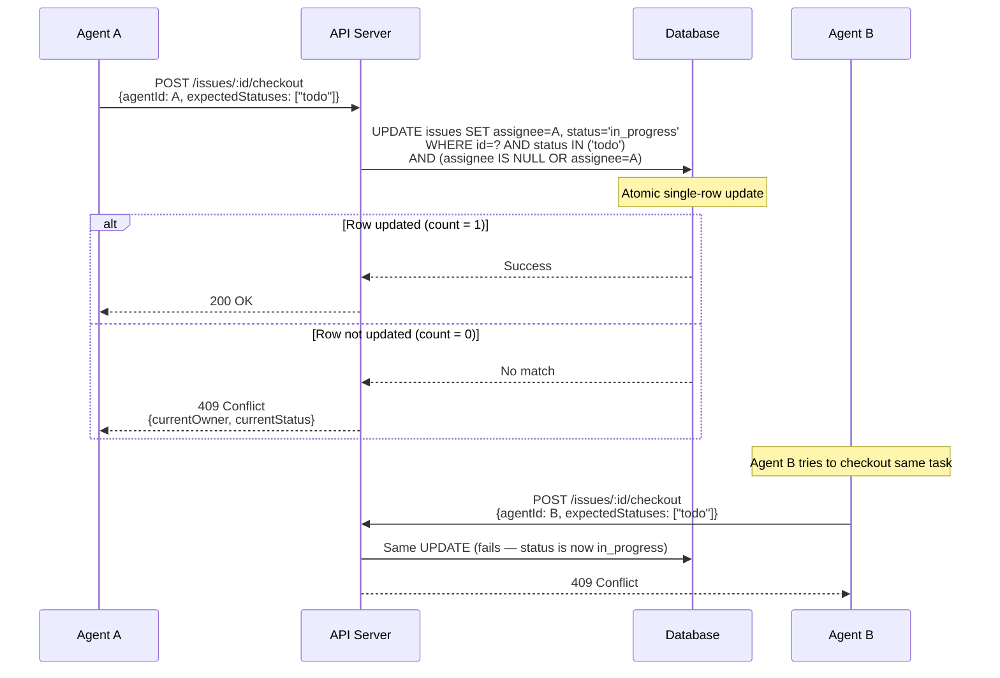
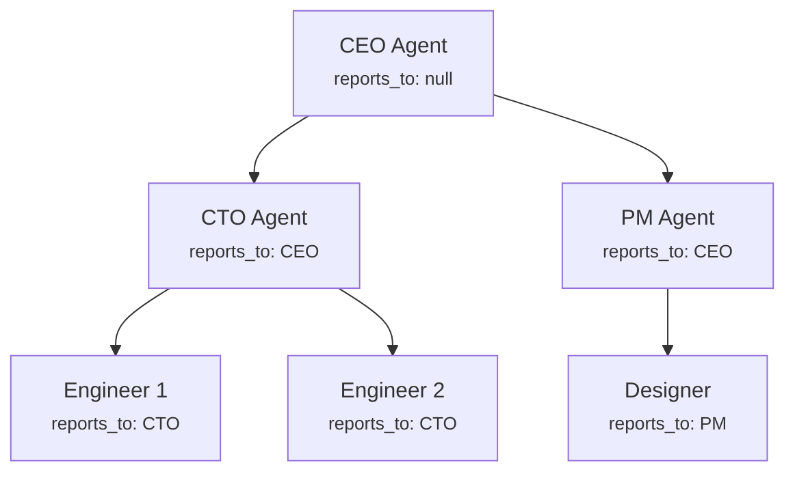
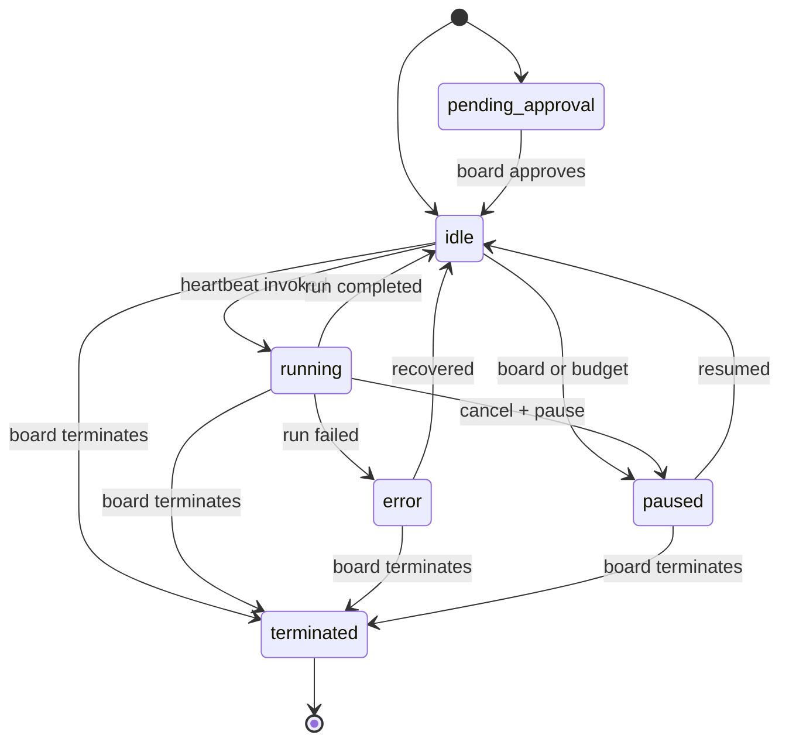
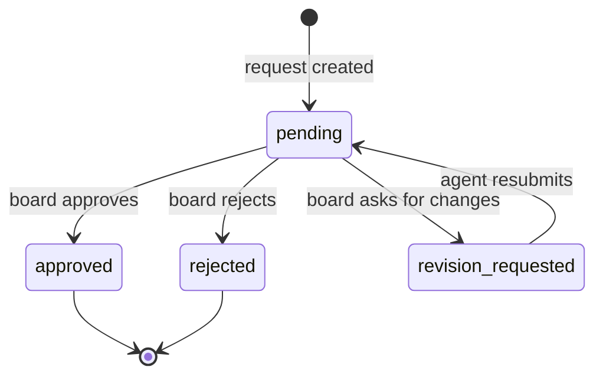
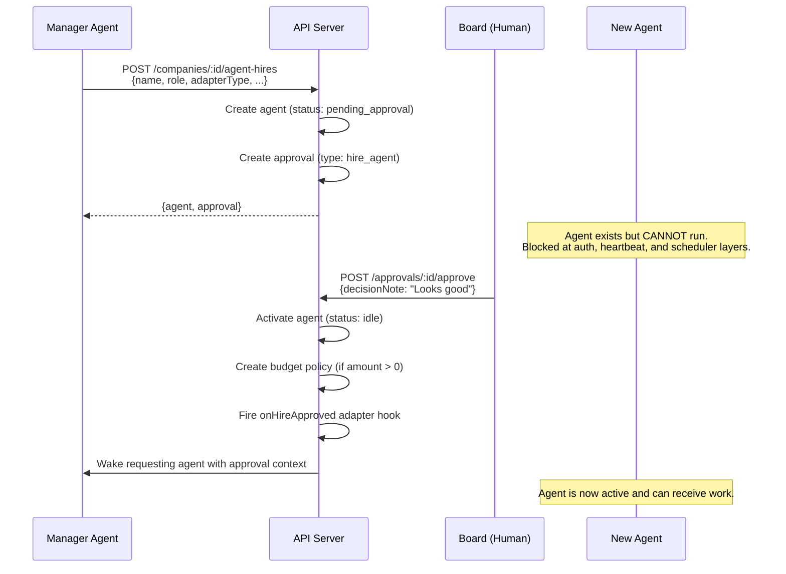
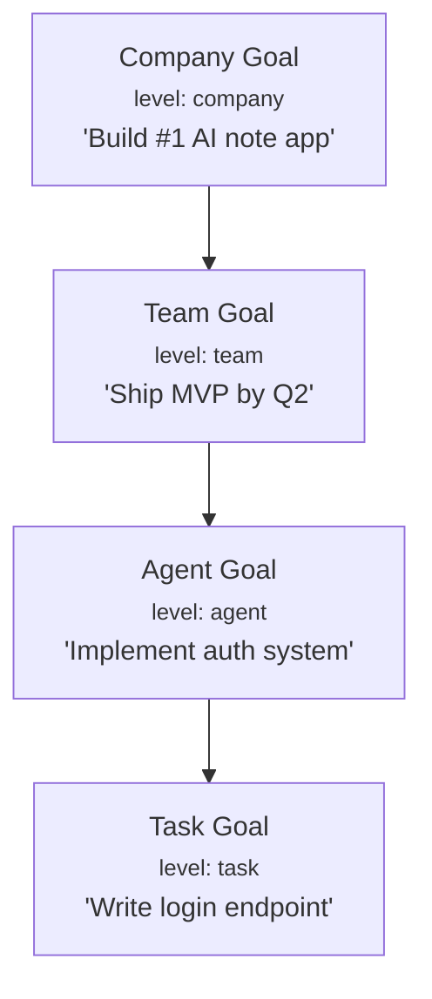
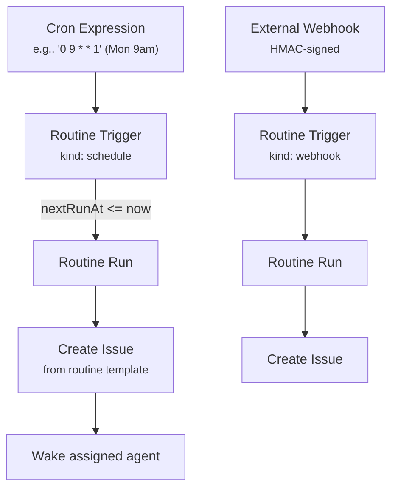
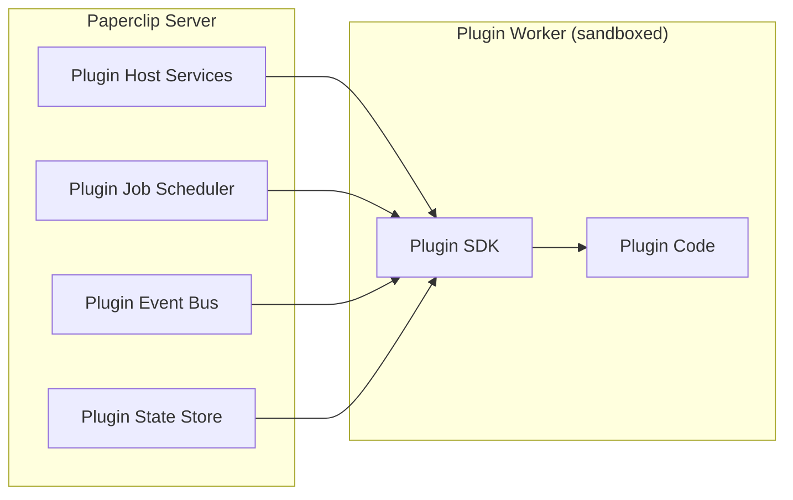

## Overview

This document covers every orchestration feature in Paperclip. Features complex enough to deserve their own page (heartbeat scheduling, budget enforcement, agent adapters) are linked out — this page provides the summary and covers the remaining features in full.

---

## Feature 1: Task Lifecycle (Issues)

### What it does

Tasks (called "issues" internally) follow a strict state machine from creation to completion. The system enforces valid transitions, single-assignee ownership, and atomic checkout to prevent race conditions.

### State Machine



**Seven statuses:** `backlog`, `todo`, `in_progress`, `in_review`, `blocked`, `done`, `cancelled`

**Terminal states:** `done` and `cancelled` — no transitions out.

**Automatic side effects:**
- Entering `in_progress` sets `startedAt`
- Entering `done` sets `completedAt`
- Entering `cancelled` sets `cancelledAt`
- Leaving a state clears its timestamp (e.g., reopening from `done` clears `completedAt`)

### Atomic Checkout

The critical concurrency primitive. When an agent wants to claim a task:



**Key properties:**
- Single SQL statement — no application-level locking needed
- Idempotent — same agent + same run calling checkout twice succeeds
- Stale lock recovery — if a previous run crashed, a new run can adopt the lock by including `"in_progress"` in `expectedStatuses`
- Never retry a 409 — it means another run definitively owns the task

### Task Hierarchy

Issues support parent/child relationships via `parentId`. Subtasks inherit execution workspace from their parent. Max traversal depth: 50 levels with cycle detection.

### Assignment Wakeup

When a task is assigned to an agent (via creation or PATCH), the system automatically fires `queueIssueAssignmentWakeup()` which calls `heartbeat.wakeup()` with source `"assignment"`. The agent gets woken up without anyone having to manually invoke it.

### Limitations

- Single assignee only — no multi-agent tasks
- No task priority queue — agents are woken for specific tasks, not by priority
- No automatic reassignment on failure (manual recovery in V1)
- Permissive state machine — most transitions are allowed, unlike a strict linear flow

---

## Feature 2: Org Chart & Agent Model

### What it does

Agents are organized in a strict tree hierarchy via `reports_to`. The org chart determines delegation paths, permissions, and management structure.

### Org Tree Structure



**Invariants:**
- Agent and manager must be in the same company
- No cycles (enforced by `assertNoCycle` traversal)
- Terminated agents cannot be resumed
- Single manager per agent (no matrix reporting)

### Agent Status Lifecycle



`pending_approval` is the entry state when `company.requireBoardApprovalForNewAgents` is true. The agent cannot do anything until approved.

### Delegation Flow

When a manager creates a task and assigns it to a subordinate:
1. `request_depth` on the issue increments (tracks delegation depth)
2. The assignee agent is auto-woken via assignment wakeup
3. The subordinate can further delegate by creating subtasks

### Permissions

| Permission | Who has it | What it allows |
|---|---|---|
| CEO role | Root agent | Full task assignment, agent creation |
| `canCreateAgents` | CEO by default, configurable | Can hire subordinates |
| `tasks:assign` | Explicit grant | Can assign tasks to other agents |
| Return to creator | Any agent | Can return an issue to whoever created it |

---

## Feature 3: Board Governance (Approvals)

### What it does

Certain actions require explicit board (human) approval before taking effect. The approval system acts as a governance gate between agent intent and execution.

### Approval Types

| Type | Triggered by | What it gates |
|---|---|---|
| `hire_agent` | Agent requests to hire | New agent activation |
| `approve_ceo_strategy` | CEO proposes strategy | Strategy execution |
| `budget_override_required` | Auto-generated | Spending past budget limit |

### Approval State Machine



### Hire Approval Flow



### Enforcement Layers

The `pending_approval` status is enforced at four separate layers:
1. **Auth middleware** — API key is blocked from making requests
2. **Agent service** — prevents direct status changes bypassing approval
3. **Heartbeat service** — prevents invocation, draining, and waking
4. **Routine execution** — excluded from scheduled task processing

### Limitations

- No multi-approver support — one board member's decision is final
- No approval timeout — pending approvals wait indefinitely
- No per-agent auto-approval rules
- Limited to three approval types in V1

---

## Feature 4: Goal Hierarchy

### What it does

Goals create a tree of objectives from company mission down to individual tasks. Every task should trace back to a company goal.

### Goal Levels



Goals are linked to agents via `ownerAgentId` and to projects via `project_goals`. Issues link to goals via `goalId` — if not set explicitly, the system falls back to the project's goal, then the company's default goal.

---

## Feature 5: Routines (Cron-Based Recurring Work)

### What it does

Routines define recurring tasks — like "every Monday at 9am, create a status report issue." They're the cron system for AI company operations.

### How it works



### Routine Components

| Component | What it stores |
|---|---|
| **Routine** | Template: title, description, assignee, project, goal, labels, priority |
| **Routine Trigger** | When to fire: cron expression + timezone, or webhook endpoint |
| **Routine Run** | Record of each execution: status, linked issue, trigger payload |

### Trigger Types

- **`schedule`** — 5-field cron expression with timezone. The scheduler evaluates these every tick.
- **`webhook`** — External HTTP trigger with HMAC signing and replay window protection.
- **`api_call`** — Direct trigger via API.

### Catch-Up Policies

| Policy | What happens when the server was down |
|---|---|
| `skip_missed` | Only fire the next scheduled run — missed runs are lost |
| `enqueue_missed_with_cap` | Replay missed runs up to a cap (max 25) |

### Concurrency Policies

| Policy | Behavior |
|---|---|
| `coalesce_if_active` | If a run is already in progress, skip the new trigger |
| `allow_parallel` | Allow multiple runs simultaneously |

### Limitations

- No dependency chains between routines
- No conditional triggers (e.g., "only fire if previous task is done")
- Cron expressions only — no "every N minutes" shorthand beyond cron syntax

---

## Feature 6: Company Portability (Import/Export)

### What it does

Companies can be exported as portable markdown packages and imported into other Paperclip instances. This enables sharing and templating entire AI company configurations.

### Package Structure

```
my-company/
  COMPANY.md                    # Company definition
  .paperclip.yaml               # Paperclip-specific metadata
  agents/
    ceo/AGENTS.md               # Agent definition
    cto/AGENTS.md
  projects/
    mvp/PROJECT.md
    mvp/tasks/auth/TASK.md
  skills/
    code-review/SKILL.md
```

### Key behaviors

- **Export** strips environment-specific paths (cwd, local file paths) while preserving portable metadata (repoUrl, refs)
- **Export** never includes secret values — env inputs become portable declarations
- **Import** supports target modes: create new company or import into existing
- **Import** forces timer heartbeats OFF so imported packages never start scheduled runs implicitly
- **Import** supports collision strategies: `rename`, `skip`, `replace`
- **Import** supports preview (dry-run) before apply

---

## Feature 7: Activity Log (Audit Trail)

### What it does

Every mutation in the system writes to the `activity_log` table, creating a complete audit trail of who did what, when, and why.

### Log Structure

| Field | What it records |
|---|---|
| `actor_type` | `"agent"`, `"user"`, or `"system"` |
| `actor_id` | Who performed the action |
| `action` | What happened (e.g., `"issue.created"`, `"approval.approved"`, `"budget.hard_threshold_crossed"`) |
| `entity_type` | What was affected (e.g., `"issue"`, `"agent"`, `"approval"`) |
| `entity_id` | Which entity |
| `details` | JSONB with action-specific context |

### What gets logged

- Task creation, updates, checkout, release
- Agent hiring, pausing, resuming, terminating
- Approval creation, decisions, resubmissions
- Cost event reporting
- Budget threshold crossings
- Heartbeat invocations and cancellations
- Governance config changes

Every log entry is also published as a live event to connected dashboard clients.

---

## Feature 8: Execution Workspaces

### What it does

Manages isolated working directories for agents executing tasks. Supports git worktrees for branch isolation, managed project workspace cloning, and per-task or shared workspace modes.

### Workspace Modes

| Mode | Behavior |
|---|---|
| `agent_default` | Use the agent's configured working directory |
| `shared_workspace` | All tasks in a project share one workspace |
| `isolated_workspace` | Each task gets its own git worktree branch |
| `operator_branch` | Use a specific branch provided by the operator |
| `reuse_existing` | Reuse a workspace from a previous task |

### Workspace Lifecycle

1. **Provision** — Clone repo, create worktree, run setup commands
2. **Execute** — Agent works in the workspace directory
3. **Teardown** — Run cleanup commands, remove worktree (if ephemeral)

Workspace provisioning and teardown commands are configurable per project. Runtime services (like local dev servers) can be attached to workspaces and managed across runs.

---

## Feature 9: Plugin System

### What it does

A full extensibility framework for third-party plugins. Plugins run in sandboxed workers and can add scheduled jobs, webhooks, UI components, tools, and state management.

### Plugin Architecture



### Plugin Capabilities

- **Scheduled jobs** — Cron-based background tasks
- **Webhooks** — Receive external HTTP events
- **UI slots** — Inject custom UI components into the dashboard
- **Tools** — Register tools that agents can use
- **State** — Scoped key-value storage (global, company, project, agent)
- **Event subscriptions** — React to system events (task created, agent hired, etc.)

### Limitations

- Plugin framework is post-V1 scope — available but not the primary extensibility path
- Plugins run in Node.js worker threads, not full process isolation

---

## Feature 10: Real-Time Events

### What it does

An in-process event system pushes mutations to connected dashboard clients instantly via SSE or WebSocket.

Every service-layer mutation calls `publishLiveEvent()` which emits on a per-company EventEmitter channel. Connected clients subscribe to their company's channel and receive typed events for agent status changes, run progress, cost updates, approval actions, and more.

---

## Feature Summary Table

| Feature | Complexity | Dedicated page? |
|---|---|---|
| Task Lifecycle | Medium | No (covered above) |
| Org Chart & Agents | Medium | No (covered above) |
| Board Governance | Medium | No (covered above) |
| Heartbeat Scheduling | **High** | [Yes — Heartbeat System](/docs/product-roadmap/xo-org/paperclip-orchestration/how-it-works/heartbeat-system) |
| Budget Enforcement | **High** | [Yes — Budget Enforcement](/docs/product-roadmap/xo-org/paperclip-orchestration/how-it-works/budget-enforcement) |
| Agent Adapters | **High** | [Yes — Agent Adapters](/docs/product-roadmap/xo-org/paperclip-orchestration/reference/agent-adapters) |
| Goal Hierarchy | Low | No (covered above) |
| Routines | Medium | No (covered above) |
| Company Portability | Medium | No (covered above) |
| Activity Log | Low | No (covered above) |
| Execution Workspaces | Medium | No (covered above) |
| Plugin System | Medium | No (covered above) |
| Real-Time Events | Low | No (covered above) |
