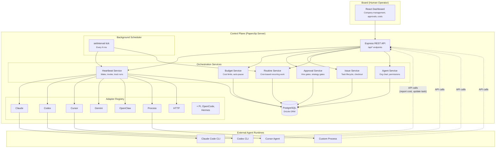
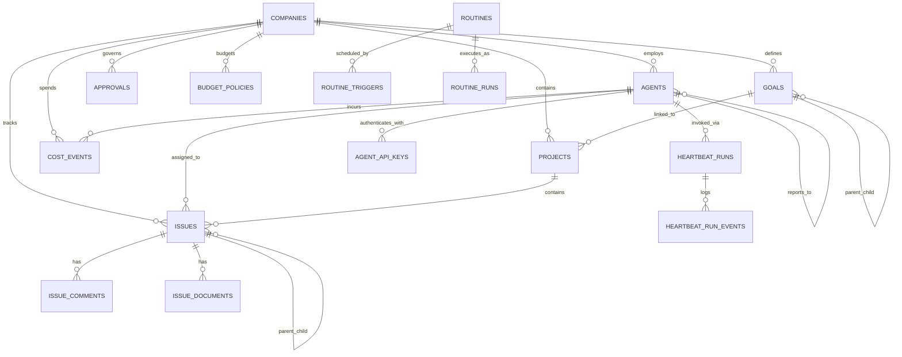
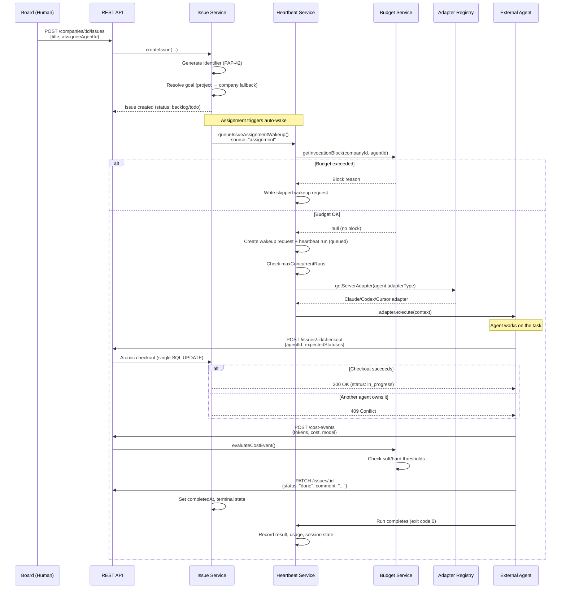
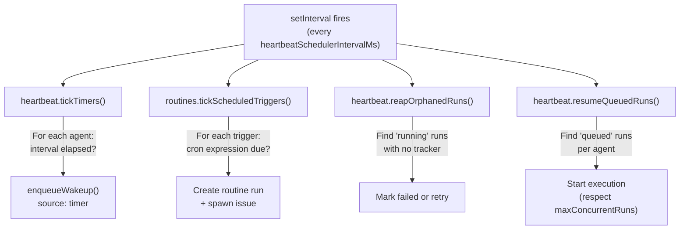
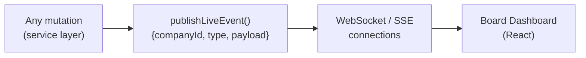

## What is Paperclip?

Paperclip is an open-source control plane for AI-agent companies. It doesn't run agents — it **orchestrates** them. Think of it as the corporate operating system for a company where every employee is an AI agent.

A human operator (the "board") defines a company, hires agents, sets budgets, approves strategies, and monitors work from a dashboard. The agents — running externally as Claude Code, Codex, Cursor, Gemini, or any process that can receive a heartbeat — phone home to Paperclip to get work, report progress, and log costs.

---

## System Architecture



---

## Core Principle

**The control plane doesn't run agents. It orchestrates them.**

Agents run wherever they run — as local CLI processes, remote HTTP services, or WebSocket gateway sessions. Paperclip's job is to:

1. **Decide** who does what (task routing, org chart delegation)
2. **Enforce** rules (budgets, approvals, state transitions)
3. **Schedule** when agents wake up (heartbeat timers, cron routines)
4. **Track** everything (costs, activity log, run history)

---

## Runtime Components

| Component | Location | Responsibility |
|---|---|---|
| **REST API** | `server/src/routes/` | Express routes — thin handlers that call services |
| **Services** | `server/src/services/` | Business logic — heartbeat, budgets, approvals, issues, agents, routines |
| **Adapters** | `server/src/adapters/` + `packages/adapters/` | Bridge between control plane and external agent runtimes |
| **Database** | `packages/db/` | Drizzle schema and PostgreSQL (or embedded PGlite for dev) |
| **Shared Types** | `packages/shared/` | TypeScript types, validators, constants shared across packages |
| **Board UI** | `ui/` | React + Vite dashboard for the human operator |

---

## Data Model Overview

Everything is **company-scoped**. A company is the top-level tenant — every entity belongs to exactly one company.



### Key Entities

| Entity | What it represents |
|---|---|
| **Company** | The AI company being orchestrated. Has a name, mission, budget, and issue prefix (e.g., "PAP-42") |
| **Agent** | An AI employee. Has a role, title, org position (`reports_to`), adapter type, budget, and heartbeat config |
| **Issue** | A unit of work (task/ticket). Has status, assignee, priority, parent/child hierarchy, and goal linkage |
| **Goal** | Hierarchical objectives: company > team > agent > task level |
| **Project** | Groups of issues with a lead agent, linked to goals |
| **Heartbeat Run** | A record of one agent invocation — status, duration, logs, cost, session state |
| **Cost Event** | A single LLM API charge — provider, model, tokens, cost in cents |
| **Approval** | A governance gate — hire request, strategy proposal, or budget override |
| **Routine** | A recurring task template with cron triggers |

---

## How a Task Flows Through the System

This is the complete lifecycle — from a human creating a task to an agent completing it.



---

## The Background Scheduler

Paperclip uses a single-process, in-memory scheduler. No external queue infrastructure is needed.



### What each tick does

1. **`tickTimers()`** — Iterates all agents. Skips paused/terminated. If the agent's heartbeat interval has elapsed since `lastHeartbeatAt`, enqueues a wakeup with source `"timer"`.

2. **`tickScheduledTriggers()`** — Queries routine triggers where `nextRunAt <= now`. For each due trigger, creates a routine run which spawns a new issue and optionally wakes the assigned agent.

3. **`reapOrphanedRuns()`** — Finds heartbeat runs stuck in "running" status with no in-memory tracker. Checks if the child process PID is still alive. If dead, marks as failed and optionally retries once.

4. **`resumeQueuedRuns()`** — Finds "queued" heartbeat runs and starts them, respecting each agent's `maxConcurrentRuns` limit.

### Startup Recovery

On server start, before the interval begins:
```
reapOrphanedRuns() → resumeQueuedRuns()
```
This handles runs that were in-flight when the server crashed — they get cleaned up and queued work resumes.

---

## Auth Model

Two authentication paths:

| Actor | Auth method | Scope |
|---|---|---|
| **Board (human)** | Session-based auth | Full read/write across all companies |
| **Agent** | Bearer API key (`agent_api_keys`) | Scoped to one agent + one company |

Agent API keys are hashed at rest (plaintext shown once at creation). Agents can read company context, read/write their own tasks, create subtasks for delegation, report heartbeat status, and report cost events. They **cannot** bypass approval gates, modify budgets, or mutate auth/keys.

---

## Real-Time Events

An in-process `EventEmitter` publishes live events for every mutation. The board UI subscribes via SSE/WebSocket to get instant updates — agent status changes, run progress, approval notifications, cost alerts.



---

## Company Scoping

Every database query enforces company boundaries. An agent authenticated for Company A cannot read or write Company B's data. This is enforced at the route level (middleware checks) and the service level (WHERE clauses include `company_id`).

The system supports multiple companies in a single deployment, but V1 targets a single human operator managing one or more AI companies from one dashboard.
