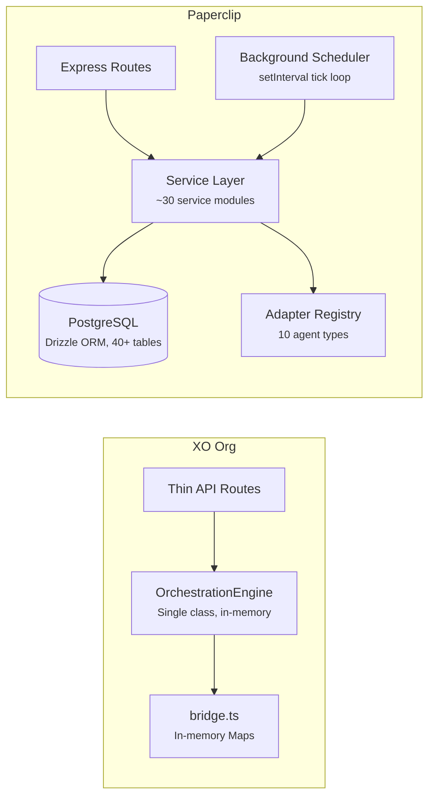
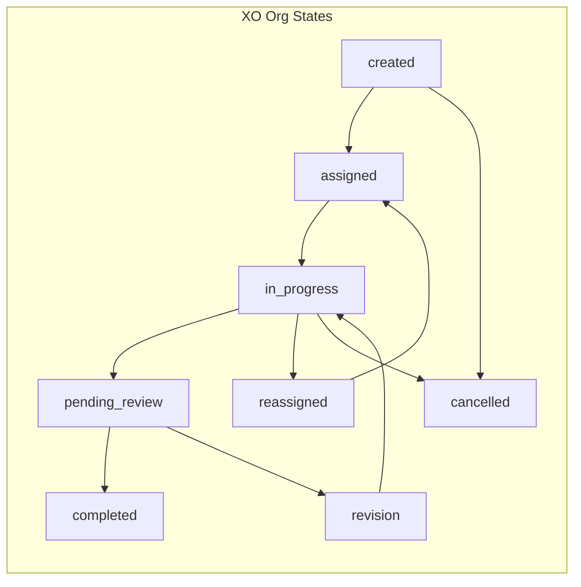
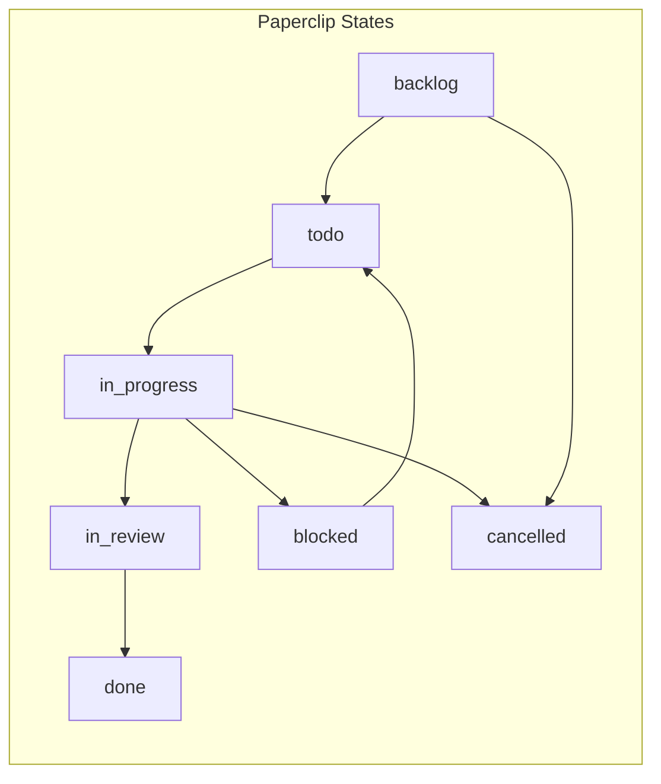
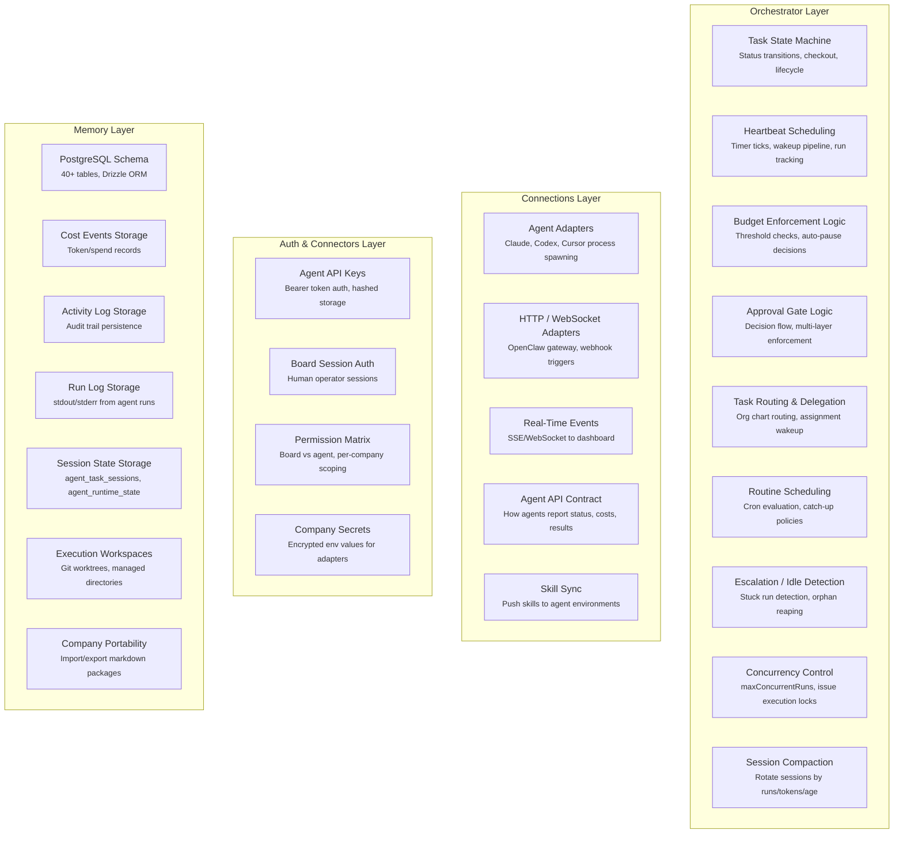
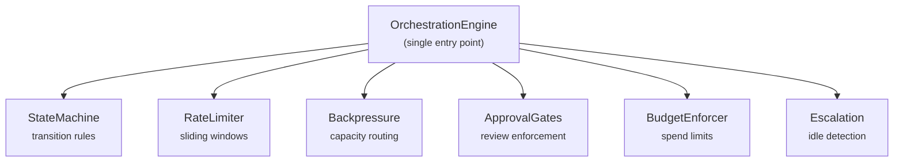

## Overview

Paperclip and XO Org both orchestrate AI agents, but they're built for different scales and use cases. This comparison maps where the two systems converge, where they diverge, and identifies concrete patterns XO Org can adopt from Paperclip's approach.

**XO Org** is a lightweight coordination layer for a single workspace — a few agents communicating via a shared event log, governed by a simple config object.

**Paperclip** is a full control plane for autonomous AI companies — multiple companies, dozens of agents per company, persistent PostgreSQL storage, budget enforcement, and a dedicated board UI.

---

## Architecture Comparison

| Aspect | XO Org | Paperclip |
|---|---|---|
| **Storage** | In-memory Maps (bridge.ts) | PostgreSQL (40+ tables, Drizzle ORM) |
| **State persistence** | Lost on restart | Fully persistent |
| **Architecture** | Single class (`OrchestrationEngine`) | ~30 service modules + adapter packages |
| **Background processing** | Piggybacks on API calls | Dedicated `setInterval` scheduler |
| **Multi-tenancy** | Single workspace | Multi-company data model |
| **Agent runtime** | External (agents call the API) | Built-in adapter system (server spawns agents) |
| **UI** | Next.js dashboard (shared with main app) | Dedicated React + Vite board UI |

---

## Feature-by-Feature Comparison

### Task State Machine

Both systems enforce valid status transitions for tasks. The state machines are similar in structure but differ in specifics.

| Aspect | XO Org | Paperclip |
|---|---|---|
| **Status count** | 7 (created, assigned, in_progress, pending_review, revision, completed, cancelled) | 7 (backlog, todo, in_progress, in_review, blocked, done, cancelled) |
| **Entry point** | `created` (immediately transitions to `assigned` on assignment) | `backlog` (can sit unassigned) |
| **Review flow** | `pending_review` → `revision` → `in_progress` (explicit rejection loop) | `in_review` → `in_progress` (simpler, no separate revision state) |
| **Blocked state** | No blocked state — agent goes offline, task gets reassigned | `blocked` state exists — can return to `todo` or `in_progress` |
| **Reassignment** | Explicit `reassigned` state with auto-recovery | No reassignment state — manual reassignment via board |
| **Transition strictness** | Strict — only defined transitions allowed | Permissive — most transitions allowed |
| **Concurrency** | No checkout mechanism | Atomic checkout (single SQL UPDATE, 409 on conflict) |

**Key difference:** Paperclip adds **atomic checkout** — a database-level concurrency primitive that prevents two agents from claiming the same task. XO Org doesn't have this because its single-agent focus makes races unlikely.

### Approval Gates

Both systems support approval before task completion, but with very different scope.

| Aspect | XO Org | Paperclip |
|---|---|---|
| **Scope** | Task completion only (agent → completed requires review) | Task completion, agent hiring, CEO strategy, budget overrides |
| **Types** | 1 (`taskApproval`) | 3 (`hire_agent`, `approve_ceo_strategy`, `budget_override_required`) |
| **Auto-approval** | By role or channel | No auto-approval — all approvals require explicit board decision |
| **Rejection flow** | `pending_review` → `revision` → `in_progress` | `pending` → `revision_requested` → `pending` (resubmit cycle) |
| **Who approves** | Admin or mod role | Board (human operator) only |
| **Enforcement** | Single check in the state machine | Multi-layer: auth, service, heartbeat, scheduler |
| **Discussion** | No approval comments | Comment threads on approvals |

**Key difference:** Paperclip's approvals are a **governance system**, not just a workflow step. They gate agent hiring, strategy changes, and budget overrides — not just task completion. The multi-layer enforcement (blocking at auth, heartbeat, and scheduler levels) makes it impossible for a pending agent to do anything.

### Rate Limiting

| Aspect | XO Org | Paperclip |
|---|---|---|
| **Approach** | Sliding window per agent (messages/min, tasks/hour) | No explicit rate limiting — budget enforcement serves this role |
| **Counters** | Per-agent or global | N/A (cost-based limits instead) |
| **Response** | 429 with Retry-After header | 409 Conflict when budget exceeded |
| **State** | In-memory `Map<string, number[]>` | N/A |

**Key insight:** Paperclip doesn't need rate limiting because budget enforcement naturally caps agent activity. An agent that burns through its budget gets auto-paused. XO Org uses rate limiting as a simpler proxy for the same goal — preventing runaway agents.

### Backpressure / Task Routing

| Aspect | XO Org | Paperclip |
|---|---|---|
| **Routing model** | Capacity-based: filter by role, sort by load, assign to lowest-load agent | Explicit assignment: tasks assigned to specific agents or delegated through org chart |
| **Overflow handling** | Three modes: queue, reject, alert | No overflow concept — if agent is busy, task stays assigned until agent is ready |
| **Queue drain** | Auto-assign when agent capacity frees up | Assignment wakeup — agent gets woken when task is assigned |
| **Load balancing** | Built-in (`activeTasks / capacity`) | Manual — the board or manager agents decide who gets what |

**Key difference:** XO Org treats agents as interchangeable workers in a role pool. Paperclip treats agents as individuals with specific positions in an org chart. In XO Org, a task goes to "@Engineering" and the system picks the best engineer. In Paperclip, a task goes to "Engineer Agent #3" because their manager decided they should do it.

### Task Reassignment

| Aspect | XO Org | Paperclip |
|---|---|---|
| **Trigger** | Agent misses 4 heartbeats (2 min offline) | No automatic reassignment |
| **Detection** | Piggybacks on heartbeat processing | Stuck run detection (process liveness check) |
| **Recovery** | Auto-reassign to another agent of same role | Manual — board or manager must reassign |
| **Reconnection** | Tasks are NOT returned to reconnecting agent | N/A |

**Key difference:** XO Org automatically redistributes work when agents go offline. Paperclip detects stuck runs and can retry them, but doesn't reassign to different agents. This is a deliberate V1 design choice — Paperclip wants humans to decide reassignment, not automate it.

### Escalation

| Aspect | XO Org | Paperclip |
|---|---|---|
| **Idle detection** | Task in assigned/in_progress > 5 min without update | No idle task detection |
| **Notification** | `tell` message to @admin | N/A (dashboard shows all run statuses in real-time) |
| **De-duplication** | In-memory `Set<string>` | N/A |
| **Trigger** | Piggybacks on API calls | N/A |

**Key difference:** XO Org's escalation fills a gap left by its simpler monitoring. Paperclip's real-time dashboard, activity log, and run status tracking serve the same purpose — the board can see exactly what every agent is doing at any moment, so explicit idle alerts aren't needed.

### Budget / Cost Tracking

| Aspect | XO Org | Paperclip |
|---|---|---|
| **Cost tracking** | None | Full: per-event tracking with provider, model, tokens, cents |
| **Budget limits** | None | Three levels: company, agent, project |
| **Enforcement** | None | Auto-pause + cancel active work on hard threshold |
| **Soft alerts** | None | At 80% utilization, create incident |
| **Hard stop** | None | At 100%, pause scope + cancel work + create approval |
| **Window** | N/A | Monthly UTC calendar or lifetime |

**Key difference:** This is XO Org's **biggest gap**. Budget enforcement is one of Paperclip's most sophisticated features. It's not just tracking — it's active enforcement that pauses agents, cancels work, and requires board intervention to resume.

### Org Structure

| Aspect | XO Org | Paperclip |
|---|---|---|
| **Agent model** | Flat list with roles | Hierarchical tree (reports_to) |
| **Hierarchy** | None — agents are peers in role pools | Strict tree: CEO → managers → individual contributors |
| **Delegation** | System routes tasks to role pools | Managers create tasks for subordinates |
| **Permissions** | Role-based (admin, mod, member) | Role + explicit grants + org position |

### Heartbeat / Agent Lifecycle

| Aspect | XO Org | Paperclip |
|---|---|---|
| **Heartbeat model** | Agent-initiated pulse every 30s | Server-initiated: scheduler wakes agents on a timer |
| **Direction** | Agent → server ("I'm alive") | Server → agent ("wake up and work") |
| **Invocation** | Agent decides when to check for work | Server decides when to invoke the agent |
| **Run tracking** | No run concept — agent is either online or offline | Full run lifecycle: queued → running → succeeded/failed |
| **Session continuity** | None | Session management across runs (per adapter) |
| **Stuck detection** | 4 missed heartbeats = offline | Process liveness check + staleness threshold |

**Key difference:** This is a fundamental architectural divergence. XO Org uses a **pull model** — agents poll the server for work. Paperclip uses a **push model** — the server spawns agent processes and pushes work to them. Paperclip's approach gives the control plane more authority over when and how agents execute.

### Agent Adapters

| Aspect | XO Org | Paperclip |
|---|---|---|
| **Adapter system** | None — agents are external HTTP clients | Full adapter registry with 10 built-in adapters |
| **Agent invocation** | Agent calls API on its own schedule | Server spawns agent via adapter (process/HTTP/WebSocket) |
| **Supported agents** | Any HTTP client | Claude, Codex, Cursor, Gemini, OpenCode, Pi, OpenClaw, + generic process/HTTP |
| **Session management** | None | Per-adapter session codec with compaction |
| **Skills** | None | Company-managed skill sync per adapter |

---

## What XO Org Can Learn from Paperclip

### 1. Budget Enforcement (High Priority)

XO Org's spec explicitly calls out "No budget/cost tracking" as the highest-priority gap. Paperclip's approach offers a proven pattern:

**What to adopt:**
- Cost event ingestion endpoint (agents report their own spend)
- Per-agent budget limits with monthly windows
- Soft warning threshold (80%) + hard stop threshold (100%)
- Auto-pause on hard stop — the agent can't work until the limit is raised

**Simplified version for XO Org:**
- Start with per-agent budgets only (skip company/project levels)
- Store budget and spend on the agent record (no separate `budget_policies` table)
- Check budget before task assignment (add to the backpressure routing flow)
- Use a governance config field: `budgets: { enabled: true, defaultMonthly: 5000 }`

### 2. Atomic Task Checkout (Medium Priority)

As XO Org scales to more agents, task ownership races become likely. Paperclip's atomic checkout pattern is elegant:

**What to adopt:**
- A `checkout` endpoint that uses a conditional update (WHERE status IN expected AND assignee IS NULL)
- 409 Conflict response with current owner info
- Idempotent — same agent calling twice succeeds

**For XO Org:** This could be added to the backpressure routing flow. When routing assigns a task, use an atomic update that fails if another route already assigned it.

### 3. Run Tracking (Medium Priority)

XO Org doesn't track agent invocations as discrete runs. Paperclip's heartbeat run model provides:

**What to adopt:**
- A `runs` table/log that records each agent invocation: start time, end time, exit code, usage stats
- Run status tracking: queued → running → succeeded/failed
- Stuck run detection: if a run has been "running" for too long, mark it as stuck

**For XO Org:** Even with XO Org's pull model, you could track each "work session" — from when the agent picks up a task to when it reports completion. This gives visibility into how long tasks actually take and whether agents are getting stuck.

### 4. Activity Audit Log (Low Priority)

Paperclip logs every mutation with actor, action, entity, and details. This is invaluable for debugging and compliance.

**What to adopt:**
- Append an event to the event log for every mutation (task created, status changed, agent hired, governance updated)
- Include `actorType` (agent/user/system), `action`, `entityType`, `entityId`
- Surface in the UI as a company-wide activity feed

**For XO Org:** The event log already exists — the bridge appends events. The gap is structured, queryable activity entries with actor attribution.

### 5. Hierarchical Goals (Low Priority)

Paperclip's goal hierarchy (company → team → agent → task) gives every task a "why." This helps agents understand context and helps the board track alignment.

**What to adopt:**
- A simple `goals` concept — even just a text field on tasks that traces to a company-level objective
- Goal-based filtering in the dashboard

---

## Where XO Org's Approach Is Stronger

### 1. Simpler Agent Integration

XO Org's "agents are HTTP clients" model is simpler to integrate with. Any agent that can make REST calls works — no adapter needed, no server-side process spawning. Paperclip's adapter system is powerful but ties agents to the server machine.

### 2. Capacity-Based Routing

XO Org's backpressure system with load-balanced routing is more sophisticated for task distribution. Paperclip relies on manual assignment or org-chart delegation, which requires more human/manager-agent involvement.

### 3. Automatic Reassignment

XO Org automatically handles agent failures by redistributing work. Paperclip deliberately leaves this manual in V1, which creates more work for the human operator.

### 4. Lighter Footprint

XO Org runs in a single Next.js process with in-memory state. Paperclip requires PostgreSQL, a monorepo build, and significantly more infrastructure. For small deployments, XO Org's simplicity is a feature.

### 5. Governance Hot-Reload

XO Org's governance config takes effect immediately via `PATCH /api/governance`. Paperclip's equivalent requires updating database records across multiple tables. XO Org's single-config approach is more ergonomic for rapid iteration.

---

## Mapping Paperclip to XO Org's 4-Layer Architecture

XO Org is divided into four layers: **Memory** (databases, file systems), **Auth & Connectors**, **Connections** (how agents communicate and interact), and **Orchestrator** (the decision-making brain). Paperclip doesn't use this same separation — its features cut across all four layers. Here's where each Paperclip orchestration feature would land in XO Org's model.

### What's Purely Orchestrator?

These Paperclip features live entirely within what XO Org would call the Orchestrator layer — they are **decision-making logic** with no storage or communication concerns of their own:

| Feature | Why it's pure orchestration |
|---|---|
| **Task state machine** | Decides which transitions are valid, enforces side effects |
| **Heartbeat timer logic** | Decides when to wake agents (interval elapsed, budget OK, policy enabled) |
| **Budget enforcement decisions** | Decides whether to pause/resume/block based on spend vs limit |
| **Approval gate logic** | Decides whether an action needs board approval and blocks until resolved |
| **Task routing** | Decides which agent gets which task based on org chart |
| **Concurrency control** | Decides whether to start/queue/coalesce a run based on maxConcurrentRuns |
| **Session compaction** | Decides whether to rotate a session based on thresholds |
| **Routine scheduling** | Decides whether a cron trigger is due |

### What Crosses Layer Boundaries?

These features span multiple layers. The **orchestrator** makes the decision, but the execution touches other layers:

| Feature | Orchestrator decides... | ...but depends on |
|---|---|---|
| **Budget enforcement** | "This agent exceeded its limit, pause it" | Memory (cost_events sum), Connections (cancel active runs) |
| **Heartbeat invocation** | "This agent is due for a run" | Connections (adapter spawns process), Auth (JWT token for agent), Memory (persist run record) |
| **Approval gates** | "This hire needs board approval" | Auth (only board can approve), Memory (approval record), Connections (wake requesting agent) |
| **Stuck run detection** | "This run looks orphaned" | Connections (check process PID), Memory (update run status) |
| **Assignment wakeup** | "Agent X was assigned a task, wake them" | Connections (trigger heartbeat invocation) |

### Key Insight for XO Org's Orchestrator

In Paperclip, the orchestrator is **not a single module**. It's the collective decision-making logic spread across `~30 service files`. Each service owns one domain (heartbeat, budgets, issues, approvals), and the orchestration "layer" is the sum of all their decision logic.

If XO Org keeps its current single-class `OrchestrationEngine` design, it would need to grow into something like Paperclip's service-per-domain pattern as features are added. The alternative is to keep the single class but have it delegate to focused sub-modules:

This keeps the single-class ergonomics while separating concerns internally — the pattern XO Org already uses, just with budget enforcement added.

---

## Convergence Summary

| Area | Status | Notes |
|---|---|---|
| Task state machine | **Converged** | Both have 7-state machines with similar flows |
| Approval gates | **Converged** | Both require human review before completion |
| Agent authentication | **Converged** | Both use API keys for agent auth |
| Activity logging | **Converged** | Both log events (XO Org: event log, Paperclip: activity_log) |
| REST API pattern | **Converged** | Both use thin routes → service layer → storage |

## Divergence Summary

| Area | XO Org | Paperclip | Priority for XO Org |
|---|---|---|---|
| Budget enforcement | None | Full 3-level system | **High** |
| Task checkout | None | Atomic SQL-level locks | **Medium** |
| Run tracking | None | Full run lifecycle | **Medium** |
| Agent invocation | Pull (agent polls) | Push (server spawns) | Architectural difference |
| Org hierarchy | Flat roles | Tree (reports_to) | Low (different model) |
| Session management | None | Per-adapter sessions | Low (different model) |
| Recurring tasks | None | Cron-based routines | Low |
| Execution workspaces | None | Git worktree isolation | Low |
